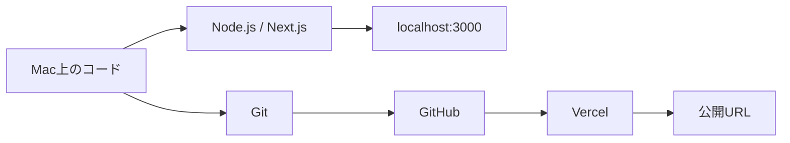
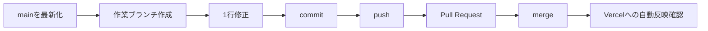

# 2026-07-11｜Next.js・Git・Vercelへの公開

## 1. 今日の到達点

- Next.js・TypeScript・React・pnpmを使う開発環境をMac上に作成した。
- `app/page.tsx`を編集し、開発サーバーを通じてブラウザに変更を表示できた。
- Gitのルートを確認し、Sandboxを親ディレクトリから独立したリポジトリとして管理できた。
- ローカルのコミットをGitHubのPrivateリポジトリへpushし、`main`の追跡関係を設定できた。
- GitHubとVercelをつなぎ、ローカルのコードが公開URLへ届く全体像を学んだ。

## 2. 今日作ったもの

- **プロジェクト名:** `talentscan-fde-sandbox`
- **ローカルの保存場所:** `/Users/chikamayasufumi/Codex/talentscan-fde-sandbox`
- **GitHubリポジトリ:** `https://github.com/yas-2317/talentscan-fde-sandbox`（`origin`のURLから確認。Privateかどうかはローカルからは未確認）
- **Vercel公開URL:** `https://talentscan-fde-sandbox.vercel.app`（本日の作業記録として申告あり。今回の確認ではTLS接続に失敗したため、現在の公開状態は未確認）
- **使用技術:** Next.js 16.2.10、React 19.2.4、TypeScript 5系、pnpm 11.11.0、Node.js v25.7.0、Git 2.50.1

バージョンは、依存関係については`package.json`、実行環境については2026-07-11の確認時点の各`--version`出力に基づく。

## 3. 全体の仕組み



- **Mac上のコード:** 自分が編集するファイルの実体。`app/page.tsx`などがここにある。
- **Node.js / Next.js:** Node.jsがJavaScriptの実行環境を提供し、Next.jsがコードをWebアプリとして処理する。
- **localhost:** 自分のMac自身を指す名前。開発サーバーの表示を自分のブラウザで確認する入口になる。
- **Git:** ファイルの変更履歴をローカルで記録する。
- **GitHub:** Gitリポジトリをネットワーク上に保存し、共有やPull Requestを可能にする。
- **Vercel:** GitHub上のコードを取得してbuild・deployし、外部からアクセスできる形にする。
- **公開URL:** Vercel上で動く成果物への入口。Macの開発サーバーを止めても、正常にdeploy済みならアクセスできる。

重要なのは、`pnpm dev`によるlocalhost表示とVercel公開は別経路だという点である。前者はMac上の現在のファイルを使い、後者は通常GitHubへpushされたコミットをVercelがbuildして使う。

## 4. 実行した主なコマンド

この節では、リポジトリ状態または本日の作業記録から確認できるものと、実行履歴を確認できないものを区別する。シェルの完全な履歴は今回確認していないため、引数まで確定できないコマンドは例示に留める。

| コマンド | 命令する相手 | 何を変更・確認するか | 今回の確認状況 |
|---|---|---|---|
| `pwd` | シェル | 現在作業しているディレクトリを表示する。 | 今回の結果は`/Users/chikamayasufumi/Codex/talentscan-fde-sandbox`。初期作業時の実行有無は未確認。 |
| `git --version` | Git | 利用できるGitのバージョンを表示する。 | Git 2.50.1を確認。初期作業時の実行有無は未確認。 |
| `node --version` | Node.js | 利用できるNode.jsのバージョンを表示する。 | v25.7.0を確認。初期作業時の実行有無は未確認。 |
| `npm --version` | npm | 利用できるnpmのバージョンを表示する。 | 11.10.1を確認。初期作業時の実行有無は未確認。 |
| `pnpm --version` | pnpm | 利用できるpnpmのバージョンを表示する。 | 11.11.0を確認。初期作業時の実行有無は未確認。 |
| `pnpm create next-app` | pnpm / create-next-app | Next.jsのプロジェクト生成プログラムを実行し、初期ファイル群を作る。 | READMEと構成はcreate-next-app由来。完全なコマンドと選択オプションは未確認。 |
| `pnpm approve-builds` | pnpm | 依存パッケージのbuild scriptを選択して実行許可する。 | 作業記録では`sharp`と`unrs-resolver`を承認。実行結果はリポジトリから未確認。 |
| `pnpm install` | pnpm | `package.json`とlockfileを読み、依存パッケージをローカルへ揃える。 | `pnpm-lock.yaml`と`node_modules`からインストール済み状態を確認。実行時の全出力は未確認。 |
| `pnpm dev` | pnpm → Next.js | `package.json`の`dev` script、つまり`next dev`を実行して開発サーバーを起動する。 | 作業記録ではlocalhost表示を確認。今回の確認時の稼働状態は未確認。 |
| `git status` | Git | 現在のbranch、追跡先、未記録の変更を表示する。 | ログ作成前は`main...origin/main`でworking treeはクリーン。 |
| `git add .` | Git | 現在位置以下の変更を、次のcommit候補であるステージ領域へ登録する。 | 初回commitから何らかの`git add`実行は分かるが、実際の引数が`.`だったかは未確認。 |
| `git commit -m "Initialize TalentScan FDE sandbox"` | Git | ステージ済み内容を説明文付きの履歴として確定する。 | 2026-07-11 21:06:34 +0900に`a9d90d9`としてcommit済み。入力した完全なコマンドは未確認。 |
| `git log` | Git | 保存されているcommit履歴を表示する。 | 初回commit `a9d90d9 Initialize TalentScan FDE sandbox`の1件を確認。 |
| `git rev-parse --show-toplevel` | Git | 現在使われているGitリポジトリのルートを絶対パスで表示する。 | 現在はSandbox自身。問題発見時の親リポジトリを示す実出力は未確認。 |
| `git init` | Git | 現在のディレクトリに`.git`管理領域を作り、リポジトリとして初期化する。 | Sandbox内の`.git`と初回commitから初期化済みと確認。実際の入力文字列は未確認。 |
| `git remote add origin https://github.com/yas-2317/talentscan-fde-sandbox.git` | Git | GitHubリポジトリのURLを`origin`という名前で登録する。この時点ではデータを転送しない。 | 現在の`origin`設定からURLを確認済み。 |
| `git remote -v` | Git | remoteのfetch用・push用URLを表示する。 | 両方とも上記GitHub URLであることを確認。 |
| `git push -u origin main` | Git | ローカル`main`のcommitを`origin/main`へ送り、同時にupstreamとして設定する。 | `HEAD`と`origin/main`は同じ`a9d90d9`で、upstream設定も確認済み。実際の入力文字列は未確認。 |

## 5. 今日理解した概念

| 用語 | 初心者向けの定義 | 前後で何とつながるか |
|---|---|---|
| ローカル環境 | 自分のMac内にある実行環境。 | コード、Node.js、pnpm、開発サーバーがここで動く。GitHubやVercelとは別の場所。 |
| localhost | ネットワーク上で「このコンピューター自身」を表す名前。 | `localhost:3000`は、Macの3000番ポートで待つ開発サーバーへの入口。 |
| 開発サーバー | 編集中のコードを開発向けに処理し、ブラウザへ返す常駐プログラム。 | `pnpm dev`でNext.jsを起動し、localhostからアクセスする。 |
| Node.js | ブラウザ外でJavaScriptを実行する基盤。 | pnpmやNext.jsの開発サーバー、build処理を動かす土台になる。 |
| pnpm | JavaScriptパッケージを管理する道具。 | `package.json`を読み、依存関係をinstallし、`dev`などのscriptを起動する。 |
| Next.js | Reactを基盤とするWebアプリケーションフレームワーク。 | 画面表示、ルーティング、サーバー処理、buildをまとめ、Node.js上で動く。 |
| Git | ファイル変更をcommit単位で記録するバージョン管理システム。 | ローカルだけでも使え、remoteを通じてGitHubと履歴を送受信できる。 |
| GitHub | Gitリポジトリをネットワーク上で保管・共有するサービス。 | ローカルGitからpushを受け、Pull RequestやVercel連携の起点になる。 |
| リポジトリ | Gitが一つの履歴として管理するプロジェクト範囲。 | `.git`に履歴と設定を保持し、Gitルート以下のファイルを管理する。 |
| Gitのルート | 一つのリポジトリの最上位ディレクトリ。 | 配下のGitコマンドは原則、この場所の`.git`を基準に動く。 |
| commit | ある時点の変更を説明文とともに履歴へ確定した記録。 | `git add`で選んだ内容から作られ、pushでGitHubへ送られる。 |
| remote | 別のGitリポジトリへの接続先設定。 | GitHubのURLなどを登録し、pushやfetchの宛先として使う。登録だけでは転送しない。 |
| origin | 中心となるremoteによく付ける慣習的な名前。 | 今回はGitHubリポジトリを指す。予約語ではないため別名にもできる。 |
| push | ローカルのcommitをremoteへ送る操作。 | ファイルそのものではなくGit履歴をGitHubなどへ送り、Vercel連携の契機にもなる。 |
| upstream | ローカルbranchが標準で対応付けられているremote branch。 | `main`と`origin/main`を対応させ、以後のpushやpullで宛先を省略しやすくする。 |
| Vercel | Webアプリのbuildと公開を行うホスティングサービス。 | GitHubへのpushを検知し、対象commitをbuild・deployして公開URLにつなげる。 |
| deploy | buildした成果物を実行環境へ配置し、アクセス可能にする工程。 | buildの後に行われ、成功すると公開URLからアプリを利用できる。 |
| build | ソースを検査・変換・最適化し、公開環境用の成果物を作る工程。 | Next.jsがソースから成果物を作り、その後Vercelがdeployする。 |

つながりを短く言うと、Macで編集したコードをNode.js上のNext.jsで確認し、Gitでcommitし、GitHubへpushし、Vercelがそのcommitをbuild・deployする。

## 6. 起きたエラーと解決

### pnpmのビルド承認

#### 何が起きたか

`pnpm install`時に、`sharp`と`unrs-resolver`がインストール中のbuild scriptを実行しようとし、承認が必要になった。

#### なぜ止まったか

依存パッケージのbuild scriptはネイティブ部品の準備などに必要な一方、ローカル環境でコードを実行する。pnpmは安全性のため、未承認のscriptを自動実行しない場合がある。今回はその保護機構により、必要な処理が承認待ちになった。本日の具体的なエラー全文は未確認。

#### `approve-builds`とは何か

`pnpm approve-builds`は、どの依存パッケージのbuild scriptを信頼して実行させるかを利用者が選択するコマンドである。パッケージ本体を追加するコマンドではなく、インストール時scriptの実行許可を管理する。

#### どう解決したか

`pnpm approve-builds`で`sharp`と`unrs-resolver`を承認し、`pnpm install`を再実行した。その後`pnpm dev`を起動し、localhostでアプリ表示を確認したと記録されている。承認内容が保存された正確な形式と当時の出力は未確認。

### Gitリポジトリのルート問題

#### 当初何が起きていたか

Sandbox内でGitコマンドを実行しても、Sandbox自身ではなく親の`Codex`ディレクトリのリポジトリが使われていた。そのままではSandboxの履歴と親側の履歴が混ざる可能性があった。

#### なぜ親のCodexディレクトリがGitの起点になったか

Gitは現在位置に`.git`がなければ親ディレクトリを順にさかのぼり、最初に見つけた`.git`を使用する。当初Sandbox内に独立した`.git`がなかったため、親のCodexリポジトリが選ばれたと考えられる。親側の当時の設定は今回未確認。

#### `git rev-parse --show-toplevel`で何を確認したか

Gitが実際に使用しているリポジトリのルートを絶対パスで確認した。独立化後の現在はSandbox自身が返る。

#### Sandboxを独立リポジトリにした理由

Sandboxだけでcommit履歴、remote、branch、GitHub連携を管理するためである。学習用プロジェクトの変更が親リポジトリへ混入するのを防ぎ、GitHub上の一つのリポジトリと一対一で対応させやすくなる。

#### 今後同じ問題を防ぐ方法

新しいプロジェクトを作成した直後に、必ず次を確認する。

```bash
pwd
git rev-parse --show-toplevel
git status
```

期待するプロジェクトパスとGitルートが一致しなければ、commitする前に止まる。独立管理する場合はプロジェクト直下で`git init`し、親側では必要に応じてそのディレクトリを管理対象外にする。ただし、親側からの除外方法と変更内容は今回のSandboxリポジトリからは未確認。

## 7. 現在のディレクトリ構造

`node_modules`、`.next`、`.git`内部と補助画像の詳細を省略し、主要ファイルだけを示す。

```text
talentscan-fde-sandbox/
├── app/
│   ├── globals.css       # アプリ全体へ適用するCSS
│   ├── layout.tsx        # 全ページ共通のHTML構造とメタデータ
│   └── page.tsx          # ルートURL「/」に表示する画面
├── docs/
│   └── learning-log/
│       └── 2026-07-11.md # 本日のFDE学習ログ
├── public/               # ブラウザへそのまま配信する静的ファイル
├── .gitignore            # Gitで追跡しないファイルの指定
├── eslint.config.mjs     # コード品質検査ESLintの設定
├── next.config.ts        # Next.jsの設定（現在は追加設定なし）
├── package.json          # 依存関係とdev/build等のscript定義
├── pnpm-lock.yaml        # 依存パッケージの正確な解決結果
├── pnpm-workspace.yaml   # pnpm workspaceとbuild承認に関する設定
├── postcss.config.mjs    # CSS処理の設定
├── README.md             # create-next-app由来の開始案内
└── tsconfig.json         # TypeScriptのコンパイル設定
```

ローカルのVercel設定として一般的な`vercel.json`、`.vercelignore`、`.vercel/`は確認できなかった。したがって、Vercel側のProject SettingsやGitHub連携設定はこのツリーだけでは確認できない。

## 8. 現在のGit状態

2026-07-11のコマンド結果に基づく。

- **Gitルート:** `/Users/chikamayasufumi/Codex/talentscan-fde-sandbox`
- **現在のブランチ:** `main`
- **最新commit:** `a9d90d90f36aadae6290d56163ed12f8eeb145da` — `Initialize TalentScan FDE sandbox`（2026-07-11 21:06:34 +0900）
- **remote:** `origin` → `https://github.com/yas-2317/talentscan-fde-sandbox.git`（fetch/push共通）
- **working tree:** ログ作成前の確認ではクリーン。このログ追加後は`docs/learning-log/2026-07-11.md`が未commitの変更となる。
- **GitHubとの接続状態:** `main`のupstreamは`origin/main`。ログ作成前はローカル`HEAD`と`origin/main`が同じcommitを指していた。ネットワーク越しにGitHubの最新状態を再取得したわけではないため、remote側に後から加わった変更の有無は未確認。

### 今日作成・変更されたファイル

初回commitの18ファイルはすべて2026-07-11に追加されている。ファイルの更新時刻でも同日作成・変更を確認した。

```text
.gitignore
README.md
app/favicon.ico
app/globals.css
app/layout.tsx
app/page.tsx
eslint.config.mjs
next.config.ts
package.json
pnpm-lock.yaml
pnpm-workspace.yaml
postcss.config.mjs
public/file.svg
public/globe.svg
public/next.svg
public/vercel.svg
public/window.svg
tsconfig.json
docs/learning-log/2026-07-11.md（本ログ更新で追加）
```

## 9. 自分の言葉で説明すべきこと

### 問1: localhostとVercelのURLは何が違うか

<details>
<summary>模範回答</summary>

localhostは自分のMac自身を指し、`pnpm dev`で動かした開発サーバーへアクセスする。VercelのURLはインターネット上のVercel環境を指し、deployされた成果物へ他の端末からもアクセスできる。localhostで見えるだけではVercelへ公開されたことにはならない。

</details>

### 問2: GitとGitHubは何が違うか

<details>
<summary>模範回答</summary>

Gitは変更履歴を管理する仕組みで、Mac内だけでも使える。GitHubはGitリポジトリをネットワーク上で保管・共有し、Pull Requestなどを提供するサービスである。Gitでcommitし、GitHubへpushすることで両者がつながる。

</details>

### 問3: `git remote add origin`は何をしているか

<details>
<summary>模範回答</summary>

ローカルGitに、GitHubリポジトリのURLを`origin`という名前で登録している。この時点ではcommitを送っておらず、pushやfetchで使用する宛先を覚えさせている。

</details>

### 問4: `git push -u origin main`の`-u`は何か

<details>
<summary>模範回答</summary>

ローカル`main`の標準的な相手を`origin/main`として設定するオプションである。この追跡関係をupstreamと呼ぶ。以後は条件が変わらない限り、`git push`のように宛先を省略できる。

</details>

### 問5: なぜSandboxを独立したGitリポジトリにしたか

<details>
<summary>模範回答</summary>

Sandboxの変更履歴、branch、remoteを親のCodexリポジトリと分離するためである。これによりSandboxだけを一つのGitHubリポジトリへ対応させ、親側へ学習用の変更を誤ってcommitする危険を減らせる。

</details>

## 10. 明日の開始地点

今日の未完了事項として、この学習ログ自体はまだcommit・pushされていない。また、今回の確認ではVercel公開URLへのTLS接続に失敗したため、ブラウザまたはVercel管理画面で現在のdeploy状態を再確認する。

その後、次の流れを一度通して、branchを使った通常の開発フローと自動deployを学ぶ。



開始時にはまず`git status`と`git rev-parse --show-toplevel`を実行し、正しいリポジトリにいて未処理の変更が何かを確認する。ログをcommit・pushした後、`main`から作業ブランチを作成する。1行修正をcommitしてGitHubへpushし、Pull Requestで差分を確認してからmergeする。最後に、mergeされた`main`をVercelが自動でbuild・deployし、公開URLへ反映したことを確認する。
