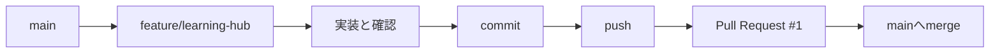
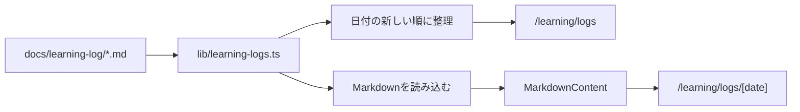

# 2026-07-12｜学習ポータルとPull Request

## 1. 今日の到達点

- `main`から作業ブランチを分け、機能開発を独立した変更として扱った。
- Markdownで保存した学習ログをWebから閲覧できるFDE学習ポータルを実装した。
- 作業ブランチのcommitをGitHubへ送り、Pull Request #1を経由して`main`へmergeした。
- branch、commit、push、Pull Request、mergeが一つの開発フローとしてどうつながるかを確認した。
- 日付形式のMarkdownを追加すると、一覧と詳細ページへ自動的に反映される仕組みを作った。

## 2. 今日作ったもの

- **機能名:** FDE学習ポータル
- **入口:** `/learning`
- **ログ一覧:** `/learning/logs`
- **日次ログ詳細:** `/learning/logs/[date]`
- **表示対象:** `docs/learning-log/YYYY-MM-DD.md`
- **作業ブランチ:** `feature/learning-hub`
- **実装commit:** `0e885a7 Add FDE learning hub`
- **merge commit:** `90c33d9 Merge pull request #1 from yas-2317/feature/learning-hub`

実装は閲覧専用の最小版に限定した。DB、認証、編集、検索、AI要約、新しい外部依存関係は追加していない。

## 3. 全体の仕組み

### 開発フロー



`main`は完成した変更を集める基準のbranchとして保ち、作業中の変更は`feature/learning-hub`へ分離した。commitで変更を一つの履歴として確定し、pushでGitHubへ送る。Pull Requestでは作業branchと`main`の差分を確認し、承認できる状態になった変更をmergeした。

### 学習ログの表示フロー



`lib/learning-logs.ts`が`docs/learning-log`内の`YYYY-MM-DD.md`を探し、ファイル名の日付で新しい順に並べる。詳細ページでは対象ファイルを読み、`MarkdownContent`が見出し、箇条書き、表、コードブロックなどをReact要素へ変換する。したがって、新しい日次ログは所定の名前で追加するだけで一覧と詳細表示の対象になる。

## 4. 実行した主なコマンド

Git履歴から結果を確認できるものと、実際のシェル入力を確認できないものを区別する。

| コマンド | 目的 | 仕組みとして起きること | 今回の確認状況 |
|---|---|---|---|
| `git switch -c feature/learning-hub` | 作業branchを作成して切り替える。 | `main`の現在地点から新しいbranch参照を作り、そのbranchを作業対象にする。 | branch名とmerge履歴から作成結果を確認。実際の入力履歴は未確認。 |
| `git status` | branchと変更状態を確認する。 | working tree、ステージ領域、最新commitとの差分を表示する。 | 現在は`main...origin/main`でworking treeはクリーン。作業中の各時点の出力は未確認。 |
| `git add ...` | commitに含める変更を選ぶ。 | working treeの変更内容をステージ領域へ登録する。 | 実装commitに8ファイルが含まれるため実行結果は確認できる。引数は未確認。 |
| `git commit -m "Add FDE learning hub"` | 学習ポータルの変更を履歴へ確定する。 | ステージ済み変更が一つのcommitとして保存される。 | `0e885a7 Add FDE learning hub`を確認。完全な入力コマンドは未確認。 |
| `git push -u origin feature/learning-hub` | 作業branchをGitHubへ送る。 | ローカルbranchのcommitがremote branchへ転送され、`-u`を使った場合はupstreamも設定される。 | GitHub上でPR #1が作られたためbranchが送信されたことは確認できる。コマンドと`-u`の使用有無は未確認。 |
| Pull Request作成操作 | `feature/learning-hub`と`main`の差分をレビュー可能にする。 | GitHub上で変更内容、commit、会話、merge操作を一つの単位として扱う。 | merge commitのmessageからPull Request #1を確認。作成方法は未確認。 |
| merge操作 | Pull Requestの変更を`main`へ取り込む。 | `feature/learning-hub`の内容が`main`の履歴へ統合される。 | `90c33d9`として2026-07-12 10:10:15 +0900にmerge済み。操作方法は未確認。 |
| `pnpm lint` | コードを静的に検査する。 | ESLintが規則違反や問題になりうる記述を調べる。 | 実装時に成功を確認済み。 |
| `pnpm build` | 本番用成果物を生成する。 | Next.jsが型検査、最適化、静的ページ生成を行う。 | 実装時に成功し、3つの学習ルートと`2026-07-11`詳細ページの生成を確認済み。 |

## 5. 今日理解した概念

| 用語 | 定義 | 今回の作業とのつながり |
|---|---|---|
| branch | 同じリポジトリ内で、特定のcommitを指す独立した開発ライン。 | `feature/learning-hub`で作業し、完成前の変更を`main`から分離した。 |
| feature branch | 一つの機能や目的のために作る作業branch。 | 学習ポータルだけを一まとまりの差分として扱えた。 |
| commit | 選択した変更を説明文付きでGit履歴へ保存したもの。 | `0e885a7`が学習ポータル実装の確定点になった。 |
| push | ローカルのcommitとbranch情報をremoteへ送る操作。 | GitHubに作業branchが届くことでPull Requestを作れるようになった。 |
| Pull Request | あるbranchの変更を別branchへ取り込むための提案とレビュー単位。 | PR #1で`feature/learning-hub`から`main`への差分を扱った。 |
| diff | 二つの状態の間にある変更差分。 | Pull Requestでは作業branchと`main`のdiffを確認する。 |
| merge | 別のbranchの変更履歴を現在のbranchへ統合する操作。 | PR #1をmergeし、学習ポータルを`main`へ取り込んだ。 |
| merge commit | mergeした事実と統合した履歴を示すcommit。 | `90c33d9`がPR #1を`main`へ統合した記録になっている。 |
| 動的ルート | URLの一部を値として受け取るルート。 | `[date]`が`2026-07-11`や`2026-07-12`のような日付を受け取る。 |
| 静的生成 | build時にHTMLをあらかじめ作る処理。 | `generateStaticParams`が存在するログの日付を列挙し、詳細ページを生成する。 |
| ファイルシステム | OSがファイルとディレクトリを管理する仕組み。 | DBを使わず、`docs/learning-log`を学習ログの保存場所として利用する。 |
| Markdown parser | Markdownの記法を画面表示用の構造へ変換する処理。 | `MarkdownContent`が文字列を解析し、React要素として安全に表示する。 |

## 6. 起きた問題と解決

### branch作成時の権限制限

最初のbranch作成では、実行環境から`.git/refs`へ書き込めず、`cannot lock ref`が発生した。Gitはbranchを作る際、`.git`内に新しい参照を書き込む必要がある。必要な権限で同じ操作を実行し、`feature/learning-hub`へ切り替えた。

これはGitの設計上のエラーではなく、作業環境のファイル書き込み制限によるものだった。エラーを見る際は、コマンド自体、Gitの状態、OSや実行環境の権限を分けて考える必要がある。

### build時のGoogle Fonts取得失敗

最初の`pnpm build`では、既存の`next/font`がGoogle FontsからGeistを取得できず失敗した。コードの型エラーではなく、build中に必要な外部通信が制限されていたことが原因だった。ネットワークアクセス可能な状態で再実行するとbuildは成功した。

buildはローカルファイルだけで完結するとは限らない。外部フォントなどをbuild時に取得する設計では、ネットワークもbuild条件の一部になる。

### localhost確認時のポートと接続範囲

開発サーバーの初回起動では3000番ポートへのbindが権限制限で失敗した。許可後に起動した際も、確認環境の接続範囲を切り分けるため、最終的に`127.0.0.1:3001`を使った。`/learning`、`/learning/logs`、`/learning/logs/2026-07-11`はいずれもHTTP 200を返した。

ポート番号はアプリそのものではなく、開発サーバーへの入口である。3000番が使えない場合でも、別の空いているポートで同じアプリを確認できる。

## 7. 今日追加された主要ファイル

```text
talentscan-fde-sandbox/
├── app/
│   ├── globals.css
│   └── learning/
│       ├── layout.tsx
│       ├── page.tsx
│       └── logs/
│           ├── page.tsx
│           └── [date]/
│               └── page.tsx
├── components/
│   └── markdown-content.tsx
├── docs/
│   └── learning-log/
│       ├── 2026-07-11.md
│       └── 2026-07-12.md
└── lib/
    └── learning-logs.ts
```

- `app/learning/layout.tsx`: 学習ポータル共通のヘッダーとナビゲーション。
- `app/learning/page.tsx`: ポータルの入口、進捗、最近のログ、次の学習内容。
- `app/learning/logs/page.tsx`: 日付の新しい順に学習ログを表示する一覧。
- `app/learning/logs/[date]/page.tsx`: URLの日付に対応するログ詳細。
- `components/markdown-content.tsx`: Markdownを見出し、リスト、表、コードなどへ変換する表示部品。
- `lib/learning-logs.ts`: Markdownファイルの探索、読込、並べ替えを担当する。
- `app/globals.css`: 学習ポータルとMarkdown本文の表示スタイル。
- `docs/learning-log/2026-07-12.md`: 本日の学習ログ。

## 8. 現在のGit状態

ログ作成前の確認結果は次のとおり。

- **Gitルート:** `/Users/chikamayasufumi/Codex/talentscan-fde-sandbox`
- **現在のbranch:** `main`
- **最新commit:** `90c33d9 Merge pull request #1 from yas-2317/feature/learning-hub`
- **実装commit:** `0e885a7 Add FDE learning hub`
- **remote:** `origin` → `https://github.com/yas-2317/talentscan-fde-sandbox.git`
- **upstream:** `main` → `origin/main`
- **working tree:** ログ作成前はクリーン。本ログ追加後は`docs/learning-log/2026-07-12.md`が未commitの変更。

ローカルの参照上は`main`と`origin/main`が同期している。ただし、今回新たに`git fetch`してGitHubの状態を再取得したわけではない。

## 9. 自分の言葉で説明すべきこと

### 問1: なぜ`main`で直接実装せず、feature branchを作るのか

<details>
<summary>模範回答</summary>

完成した変更を置く`main`と作業途中の変更を分離するため。機能単位の差分が明確になり、確認、レビュー、取り消し、並行作業がしやすくなる。

</details>

### 問2: commitとpushは何が違うか

<details>
<summary>模範回答</summary>

commitはローカルGitの履歴へ変更を保存する操作。pushは、そのcommitをGitHubなどのremoteへ送る操作。commitしただけではGitHubには届かない。

</details>

### 問3: Pull Requestは単なるmergeボタンではなく、何のためにあるか

<details>
<summary>模範回答</summary>

どのbranchからどのbranchへ、どの変更を取り込むかを提案し、diff、commit、説明、レビュー、確認結果を一つの場所で扱うためにある。mergeはその最後の統合操作。

</details>

### 問4: `[date]`というディレクトリ名は何を表すか

<details>
<summary>模範回答</summary>

Next.jsの動的ルートを表す。たとえば`/learning/logs/2026-07-12`へアクセスすると、`date`には`2026-07-12`が入り、その日付のMarkdownを探せる。

</details>

### 問5: なぜ新しいログを追加するだけで一覧に表示されるのか

<details>
<summary>模範回答</summary>

一覧が日付をコードへ直接書き込んでいるのではなく、`lib/learning-logs.ts`が`docs/learning-log`内のファイルを毎回列挙しているため。`YYYY-MM-DD.md`に一致するファイルは自動的に表示対象になる。

</details>

## 10. 次の開始地点

本ログはまだcommitされていないため、まず差分を確認し、ログだけをcommitする。その際、昨日作った機能開発のcommitと、今日の学習記録のcommitを分けておくと履歴の目的が明確になる。

次に学ぶ候補は、Vercelで`main`のmerge後に自動deployが実行されたかを確認し、次の流れを説明できるようにすることである。

```text
Pull Requestをmerge
→ GitHubのmainが更新
→ Vercelが更新を検知
→ Next.jsをbuild
→ 成功した成果物をdeploy
→ 公開URLへ反映
```

Vercelの画面で、対象commit、build結果、deploy時刻、公開URLを対応付けて確認する。今回のリポジトリ確認だけでは、Vercel側の自動deploy結果は未確認である。
