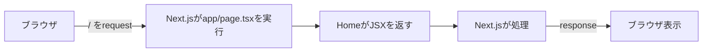

# 2026-07-13｜ブラウザ・サーバーとServer Component

## 今日の到達点

- requestから画面表示までの流れを理解した。
- `app/page.tsx`と`Home()`の役割を読めた。
- Server／Client Componentを区別できた。

## 今日理解した全体の流れ

ブラウザが受け取るのは`.tsx`ではなく処理結果である。

## 今日理解した概念

| 概念 | 役割 |
|---|---|
| ブラウザ | ページを要求し、結果を表示する。 |
| サーバー | requestを処理し、responseを返す。 |
| `app/page.tsx` | トップページ`/`を担当する。 |
| `Home()` | 画面構造をJSXで返す。 |
| JSX | TypeScript内の画面構造。 |
| Server Component | デフォルトでサーバー上で動く。 |
| Client Component | `"use client"`を付け、ブラウザで動く。 |

## 実行場所の違い

| 場所 | サーバー処理に使う資源 |
|---|---|
| localhost | 自分のMacのCPU・メモリ |
| Vercel公開版 | Vercel側のクラウド資源 |
| Bedrock | AWS側のAI推論資源 |
| Supabase | Supabase側のDB資源 |

## コードの読み方

- `export default`：`Home`を標準出力にする。
- `function Home()`：ページを作る関数。
- `return`：JSXを実行結果として返す。
- JSX：TypeScript内の画面構造。
- `<main>`：主要部、`<h1>`：主見出し、`
`：段落。

## Server ComponentとClient Component

| 項目 | Server Component | Client Component |
|---|---|---|
| 実行場所 | サーバー | ブラウザ |
| 指定 | デフォルト | `"use client"` |
| 得意 | DB、秘密情報、初期表示 | クリック、state、フォーム |
| JavaScript送信量 | 少ない | 増える |

## 今日の理解確認

1. `app/page.tsx`はどのURLを担当するか
   - 回答：トップページ`/`。
2. `Home()`は何を返すか
   - 回答：画面構造をJSXで返す。
3. localhostではどこで実行されるか
   - 回答：Mac上のNode.js / Next.js。

## 現在地

- ブラウザとサーバーの役割：要求側と応答側。
- `app/page.tsx`の役割：`/`を担当する。
- Server Componentの実行場所：localhostはMac、公開版はVercel。
- Client Componentとの違い：ブラウザで操作やstateを扱う。

## 次回

URL、HTTP、request、responseの関係を学ぶ。
