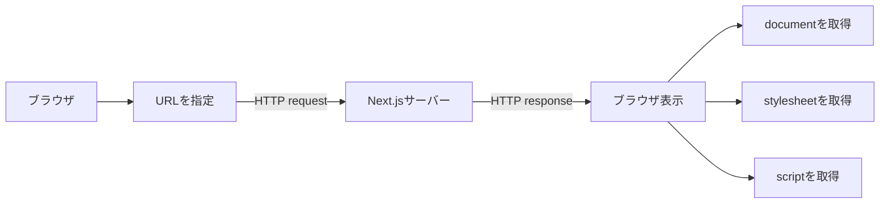

# 2026-07-14｜URL・HTTP・Networkタブ

## 今日の到達点

- URLを接続先と取得対象に分解して読めた。
- request、response、GET、200 OKの関係を理解した。
- Networkタブで1回の通信内容を確認できた。
- 1ページが複数の部品を通信で取得すると理解した。

## 今日理解した全体の流れ

最初のページ本体に加え、表示に必要な見た目や処理も別々に取得する。

## URLの読み方

`http://localhost:3000/`を分解した。

| 部分 | 意味 |
|---|---|
| `http` | 通信方式。 |
| `localhost` | 接続先である自分のMac。 |
| `3000` | Next.js開発サーバーの待受ポート。 |
| `/` | トップページ。 |

## HTTPの基本

| 用語 | 意味 |
|---|---|
| HTTP | ブラウザとサーバーの通信ルール。 |
| request | ブラウザからサーバーへの要求。 |
| response | サーバーからブラウザへの返答。 |
| GET | ページやデータの取得要求。 |
| 200 OK | 正常に返答された状態。 |

トップページを開くと、通常は`GET /`が送られる。

## DevToolsで確認したこと

| 項目 | 確認内容 |
|---|---|
| Request URL | どこへ要求したか。 |
| Request Method | どの方法で要求したか。 |
| Status Code | 処理が成功したか。 |

Networkタブの1行は、1回のrequestとresponseの組を表す。

## 1ページで複数通信が発生する理由

| Type | 件数 | 役割 |
|---|---:|---|
| document | 1 | ページ本体。 |
| stylesheet | 1 | ページの見た目。 |
| script | 18 | ブラウザ側で動くJavaScript。 |

script 18件は18ページではなく、18個のJavaScriptファイルである。Next.jsやReactが必要な処理を複数ファイルに分割して配信するため、1ページでも通信は複数になる。

## 今日の理解確認

1. URLを1回開いても複数通信が発生するのはなぜか
   - 回答：ページ表示用の部品を分割して読み込むため。
2. stylesheetは何を担当するか
   - 回答：ページの見た目。
3. scriptが18件あるのは何を意味するか
   - 回答：18個のJavaScriptファイルを読み込んでいる。

## 現在地

- URLの構造：通信方式、接続先、ポート、パスに分解できる。
- request / response：要求と返答の組として説明できる。
- Networkタブ：通信ごとのURL、方法、結果を確認できる。
- document / stylesheet / script：本体、見た目、処理を担当する。

## 次回

フロントエンドとバックエンドの役割分担を学ぶ。
