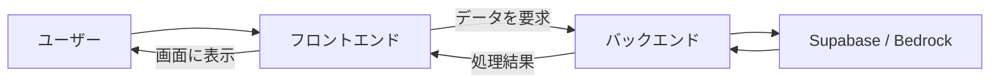

# 2026-07-15｜フロントエンドとバックエンド

## 今日の到達点

- フロントエンドとバックエンドを、ユーザーに見える役割と裏側の役割に分けて説明できた。
- 同じ候補者一覧でも、データ取得と画面表示で担当が分かれると理解した。
- 重要な処理をバックエンドに置く理由を理解した。
- `app/page.tsx`のコードと実際の画面表示を対応付けて読めた。

## 今日理解した全体の流れ



フロントエンドが操作と表示を担当し、バックエンドがデータ取得、重要な処理、外部サービス連携、保存を担当する。

## 役割の違い

| 項目 | フロントエンド | バックエンド |
|---|---|---|
| 主な役割 | ユーザーが見る・操作する画面 | データ取得、処理、保存、外部連携 |
| 動く場所 | 主にブラウザ | 主にサーバー |
| 得意な処理 | 表示、クリック、並び替え、入力チェック | DB操作、認証、Bedrock呼び出し |
| 扱う情報 | 画面表示に必要な情報 | 秘密情報や重要な業務処理 |

フロントエンドにも並び替えや入力チェックなどの軽い処理はある。「処理があるか」ではなく、役割と安全性で担当を判断する。

## TalentScanでの分類

| 処理 | 担当 |
|---|---|
| タイトルを表示する | フロントエンド |
| ボタンを表示し、クリックを受け取る | フロントエンド |
| 候補者一覧を画面に並べる | フロントエンド |
| Supabaseから候補者を取得する | バックエンド |
| Bedrockへ面接回答を送る | バックエンド |
| AI評価をDBへ保存する | バックエンド |

候補者一覧では、バックエンドがデータを取得し、フロントエンドが受け取ったデータを並べて表示する。一つの機能の中でも責務は分かれる。

## なぜバックエンドを経由するのか

ブラウザからDBやBedrockへ無制限に直接接続すると、認証情報や重要な処理が利用者側へ露出しやすい。バックエンドを入口にすると、権限確認や処理を集約でき、フロントエンドを表示と操作に集中させられる。

## `app/page.tsx`と画面の対応

```tsx
export default function Home() {
  return (
    <main>
      <h1>TalentScan FDE Sandbox</h1>
      <p>FDE学習用の検証アプリ</p>
    </main>
  );
}
```

| コード | 画面での役割 |
|---|---|
| `export default` | Next.jsがこの関数をページとして使えるようにする。 |
| `function Home()` | トップページの画面構造を作る。 |
| `return` | 表示するJSXを関数の結果として返す。 |
| `<main>` | ページの主要部分をまとめる。 |
| `<h1>` | 「TalentScan FDE Sandbox」という主見出しになる。 |
| `<p>` | 「FDE学習用の検証アプリ」という説明文になる。 |

このコードは現在の`/`の見た目を定義している。ブラウザには`.tsx`そのものではなく、Next.jsが処理した結果が届く。

## 今日の理解確認

1. 候補者一覧の取得と表示は、どちらが担当するか
   - 回答：バックエンドが取得し、フロントエンドが表示する。
2. なぜDB操作を基本的にバックエンドで行うのか
   - 回答：安全性を守り、重要な処理と権限確認を集約するため。
3. `<h1>`と`<p>`は画面の何に対応するか
   - 回答：`<h1>`は主見出し、`<p>`は説明文に対応する。

## 現在地

- フロントエンド：ユーザーが見る画面と操作を担当する。
- バックエンド：データ取得、外部連携、保存などを担当する。
- 役割分担：一つの機能でも取得と表示で担当が分かれる。
- `app/page.tsx`：JSXの各要素がトップページの表示に対応する。

## 次回

フロントエンドからバックエンドへデータを要求するAPIの基本を学ぶ。
