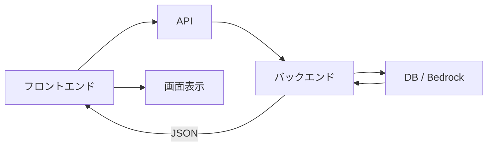
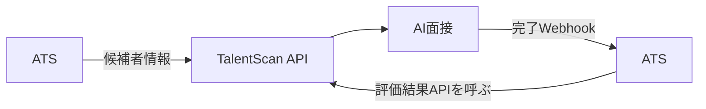

# 2026-07-16｜APIとJSON

## 今日の到達点

- APIを、画面や別システムからバックエンド処理を呼ぶ窓口として説明できた。
- JSONの配列、オブジェクト、項目名、値を区別できた。
- TalentScanとATSの双方向連携をAPIとWebhookで整理できた。
- 「APIの口を開ける」に必要な設計項目を理解した。

## APIとJSONの基本

APIは、相手のシステムへ処理やデータを要求するための境界である。JSONは、その境界を通して情報を決まった形で受け渡す形式である。フロントエンドは受け取ったJSONをそのまま見せず、画面へ変換する。

## APIが必要な処理・不要な処理

| APIのような境界が必要 | 画面内で完結できる |
|---|---|
| DBから取得・DBへ保存 | 画面の開閉や表示変更 |
| Bedrockの呼び出し | 取得済みデータの軽い並び替え |
| 認証の確認 | 画面内の簡単な入力確認 |

ブラウザからサーバー処理を依頼するときは基本的にAPIのような境界を通る。ただし、バックエンド内部のすべての処理が外部公開APIを経由するわけではない。

## フロントエンドからバックエンドまでの流れ



API内部ではURLとGET、POSTなどのHTTPメソッドによって処理を分けられる。

## アプリ同士のAPI連携

呼び出す側がブラウザから別アプリへ変わっても基本構造は同じである。エンドポイント、HTTPメソッド、認証情報、JSON形式を双方で決める。

## APIとWebhook

APIは呼び出す側から要求する仕組み、Webhookは変化が起きた側から相手へ通知する仕組みである。



## 連携要件で確認すること

| 観点 | 確認すること |
|---|---|
| データ | 何を、現在どちらが持つか |
| 方向 | どちらからどちらへ流すか、誰が呼ぶか |
| タイミング | いつ連携するか |
| 契約 | URL、メソッド、認証、JSON形式 |
| 結果 | 成功・失敗をどう判断するか |
| 障害対応 | 失敗時にどう再送・復旧するか |

## 情報を持つ側・呼ぶ側・データの流れ

この3つは必ずしも一致しない。同じ2システム間でも、候補者情報はATSからTalentScanへ、AI評価結果はTalentScanからATSへ流れる。データごとに向きと呼び出し元を確認する。

## 「APIの口を開ける」とは

外部からアクセスできるURLと、そこで動くバックエンド処理を用意することである。たとえばNext.jsでは、次の対応を設計できる。

```text
app/api/candidates/route.ts
POST /api/candidates
```

URLとメソッド、受け取るJSON、APIキーなどの認証、入力検証を決める。処理ではDB保存やAI呼び出しを行い、成功・失敗のresponseを返してVercelなどへ公開する。本格実装は8月17日〜23日のAPI週に行う予定である。

## JSONの構造

| 記号・要素 | 意味 |
|---|---|
| `[]` | 複数データをまとめる配列 |
| `{}` | 1件分のオブジェクト |
| `"name"` | 項目名 |
| `"Leanne Graham"` | 値 |

## 今日の理解確認

1. `[]`と`{}`の違い
   - 回答：複数をまとめる配列か、1件のオブジェクトか。
2. JSONは何のために使うか
   - 回答：情報を定型化して受け渡すため。
3. フロントエンドはJSONをそのまま表示するか
   - 回答：表示せず、見やすい画面へ変換する。

## 現在地

- API：バックエンドの処理やデータを要求する窓口。
- JSON：システム間で情報を定型化して渡す形式。
- アプリ間連携：呼ぶ側、方向、形式、認証、失敗時対応を決める。
- Webhook：変化が起きた側から相手へ通知する仕組み。
- APIの口を開ける：外部URLとそこで動く処理を用意すること。
- 連携要件の確認：データごとに所有者、呼ぶ側、流れる方向を分けて考える。

## 次回

DBと永続化を学ぶ。
