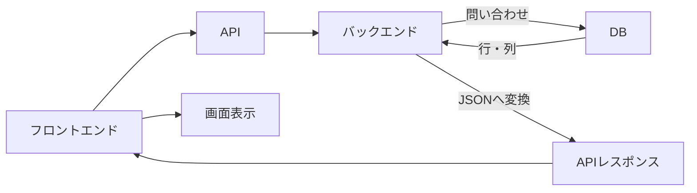

# 2026-07-17｜DBと永続化

## 今日の到達点

- メモリとDBを、保存期間と用途で区別できた。
- 永続化を、後から再取得できる保存として説明できた。
- DBの行・列がJSONを経て画面へ届く流れを理解した。
- SQLをDBへ取得・変更を指示する言語として捉えられた。

## メモリとDBの違い

| 項目 | メモリ | DB |
|---|---|---|
| 保存期間 | プログラム実行中の一時保存 | 後から使うための継続保存 |
| 再起動後 | 基本的に消える | 保存済みデータは残る |
| 主な用途 | 計算途中や画面の一時状態 | 再取得したい業務データ |
| TalentScanの例 | 開閉状態、一時的な並び順 | 候補者、回答、評価 |

## 永続化とは

データをサーバーの終了や再起動後も、後から再取得できる形で保存すること。判断基準は「後日や再起動後にも必要か」である。

## TalentScanで保存するデータ

| データ | DB保存 | 理由 |
|---|---|---|
| 候補者情報 | 必要 | 継続して参照するため |
| 面接回答 | 必要 | 評価や振り返りに使うため |
| AI評価 | 必要 | 選考判断に使うため |
| 人事評価 | 必要 | 選考履歴として残すため |
| 一時的な画面の開閉状態 | 原則不要 | その操作中だけ使うため |
| 画面上だけの並び替え | 場合による | 後日も再現するかで決める |

## DBから画面表示までの流れ



## DBのテーブルとJSONの違い

DBは保存場所・保存形式、JSONはシステム間の受け渡し形式である。一般的なリレーショナルDBはテーブル・行・列で持ち、バックエンドが必要な部分をJSONへ整える。

| id | name | score |
|---:|---|---:|
| 1 | 田中太郎 | 82 |
| 2 | 山田花子 | 91 |
| 3 | 鈴木一郎 | 74 |

```json
[
  { "id": 1, "name": "田中太郎", "score": 82 },
  { "id": 2, "name": "山田花子", "score": 91 }
]
```

DBの中身が最初からJSONとは限らない。

## SQLとは

SQLはDBへ指示を出すための言語である。今日は役割と取得例までを確認した。

| SQL | 役割 |
|---|---|
| `SELECT` | 取得 |
| `INSERT` | 追加 |
| `UPDATE` | 更新 |
| `DELETE` | 削除 |

```sql
SELECT id, name, score
FROM candidates
WHERE score >= 80;
```

`candidates`テーブルから、80点以上の行にある3列を取得する。SQLの実践は8月24日〜30日のDB／SQL／Supabase週で行う。

## Supabaseの場合

ライブラリ経由で問い合わせる場合もある。見た目はSQLと異なるが、内部ではDBへ取得条件を伝えている。

```ts
const { data } = await supabase
  .from("candidates")
  .select("id, name, score")
  .gte("score", 80);
```

SupabaseでSQLを一切使わないという意味ではない。

## 今日の理解確認

1. メモリとDBの違いは何か
   - 回答：メモリは実行中の一時保存、DBは再起動後も再取得できる保存場所。
2. 永続化とは何か
   - 回答：後から再取得できる形でデータを保存すること。
3. DBのデータはどのように画面へ表示されるか
   - 回答：バックエンドが必要な行・列を取得し、JSONで返し、フロントエンドが画面へ変換する。

## 現在地

- メモリ：実行中に使う一時的な保存場所。
- DB：後から必要なデータを残す保存場所。
- 永続化：再起動後や後日も再取得できる保存。
- SQL：DBのデータを取得・追加・更新・削除する言語。
- DBからJSONへの流れ：バックエンドが行・列を取得し、APIで返す形式へ整える。

## 次回

ブラウザ、フロントエンド、バックエンド、API、JSON、DBを使ってTalentScan全体を構造分解する。
