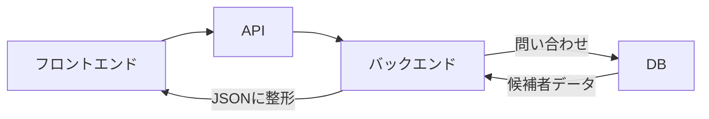
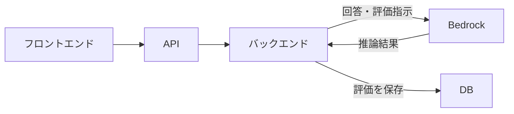

# 2026-07-18｜TalentScanの構造分解

## 今日の到達点

- 7要素の役割を区別できた。
- API、バックエンド、DB、JSONの関係を説明できた。
- 候補者一覧を取得して表示する流れを整理できた。
- BedrockでAI評価を生成し、DBへ保存する流れを理解した。

## 7要素の役割

| 要素 | 役割 |
|---|---|
| ブラウザ | Webページを取得し、画面として表示・操作するソフト。 |
| フロントエンド | ユーザーが見る画面と操作部分を担当する。 |
| API | フロントエンドや他システムがバックエンド処理を呼ぶ窓口。 |
| バックエンド | 取得・検証・保存・認証・AI呼び出しを処理する。 |
| DB | 再起動後や後日も必要なデータを永続保存する。 |
| JSON | システム間で受け渡しやすく構造化したデータ形式。 |
| Bedrock | AWS上の生成AIモデルをAPI経由で呼び出す基盤。Bedrock自体がモデルではない。 |

## TalentScanの機能分類

| 機能 | 主な担当 |
|---|---|
| ログイン画面表示 | フロントエンド |
| ログイン情報確認 | バックエンド |
| 候補者一覧表示 | フロントエンド |
| 候補者データ取得 | バックエンド |
| 面接回答保存 | バックエンド＋DB |
| AI評価生成 | Bedrock |
| AI評価結果保存 | バックエンド＋DB |

APIは処理の入口、バックエンドは処理主体、DBは保管場所である。JSONは処理場所ではなく返却データの形式で、Bedrockは推論結果を返すがDB保存はしない。

## 候補者一覧取得の流れ

フロントエンドがAPIを呼び、バックエンドがDBから候補者データを取得する。取得結果をJSONへ整えて返し、フロントエンドが一覧表示へ変換する。

## AI評価実行・保存の流れ

バックエンドが面接回答と評価指示をBedrockへ送り、返された推論結果を保存用に整えてDBへ保存する。

## 2つの処理の違い

- 候補者一覧取得：保存済みデータを取得して表示する。
- AI評価実行・保存：新しい評価データを生成して保存する。

## 今日の理解確認

1. 候補者一覧取得でDBのあとに再びバックエンドを通る理由は何か。
   - 回答：取得したデータをJSON形式に整え、定型化して返すため。
2. Bedrockから直接DBへ保存しない理由は何か。
   - 回答：BedrockはAI推論を担当し、保存はバックエンドとDBが担当するため。
3. 2つの処理の違いは何か。
   - 回答：一方は保存済みデータの取得・表示、もう一方は評価の生成・保存である。

## 現在地

- ブラウザ：Webページを表示・操作する。
- フロントエンド：ユーザー向けの画面と操作を担当する。
- API：バックエンド処理を呼ぶ入口になる。
- バックエンド：取得・検証・保存や外部サービス呼び出しを担う。
- DB：必要なデータを永続保存する。
- JSON：システム間でデータを受け渡す形式である。
- Bedrock：生成AIモデルを呼び出して推論結果を返す。
- 候補者一覧取得：DBの保存済みデータをJSONで画面へ届ける。
- AI評価実行・保存：Bedrockの推論結果をバックエンドがDBへ保存する。

## 次回

今週学んだ内容を、自分の言葉でTalentScanの構成図と説明にまとめる。
