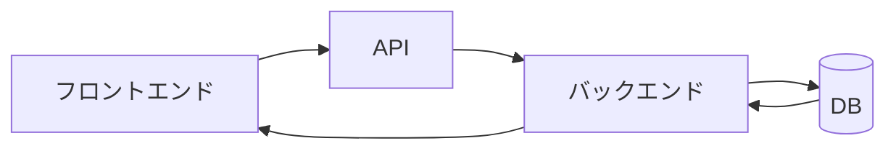
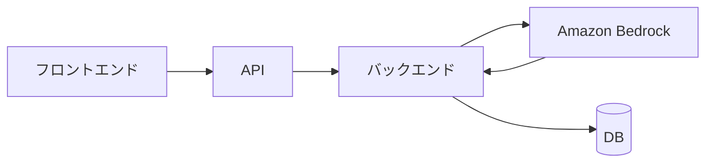

# 2026-07-19｜Week 1復習：TalentScanのデータフロー

## 今日の到達点

- API、バックエンド、DB、Bedrockの役割を区別できた。
- 候補者一覧取得とAI評価実行・保存の違いを説明できた。
- DB取得後にバックエンドを通す理由を説明できた。
- バックエンドが返す形式はJSONだけではないと理解した。

## 候補者一覧取得の流れ

ブラウザで候補者一覧の取得を指示すると、フロントエンドが操作を受け取り、APIを経由してバックエンドへ要求する。バックエンドはDBから情報を取得し、利用側にとって安全で扱いやすい形へ整えてフロントエンドへ返す。ブラウザは、フロントエンドが受け取った情報を一覧として表示する。

返却形式の代表例はJSONだが、JSONは処理主体ではなく、バックエンドが用途に応じて選ぶデータ形式である。

## AI評価実行・保存の流れ

フロントエンドがAPI経由で評価実行を依頼すると、バックエンドが面接回答と評価指示をBedrockへ送る。BedrockはAI推論結果を返し、バックエンドが結果を検証・整形してDBへ保存する。BedrockはAI推論を担当するサービスであり、保存処理は担当しない。

## 2つの処理の違い

| 処理 | 出発点 | 主な処理 | 結果 |
|---|---|---|---|
| 候補者一覧取得 | DBに保存済みのデータ | 読み出して利用側向けに整える | 画面へ表示する |
| AI評価実行・保存 | 面接回答と評価指示 | Bedrockで新しい評価を生成する | DBへ書き込む |

取得は「すでにあるデータを読む」処理、AI評価は「新しいデータを作って残す」処理である。

## JSON以外の返却形式

| 用途 | 主な形式 |
|---|---|
| Web画面へのデータ返却 | JSON |
| 表形式データの一括出力 | CSV、Excel |
| 評価レポート | PDF |
| Webページそのもの | HTML |
| 顔写真など | 画像 |
| 古い業務システムとの連携 | XML |
| 高速なシステム間通信 | Protocol Buffers |

TalentScanでは、候補者一覧の画面表示にはJSON、一括出力にはCSVまたはExcel、評価レポートにはPDF、顔写真には画像データを使える。形式は、利用者と用途に合わせて選ぶ。

## DBの後にバックエンドを通る理由

DBから取得した値をそのまま利用側へ渡すとは限らない。バックエンドでは次の処理を行う。

- 不要な項目を除く。
- 複数項目を結合する。
- 項目名を画面向けに変更する。
- 権限上、見せてよい情報だけを返す。
- 利用者が扱いやすい構造へ整える。
- JSON、CSV、PDFなど、用途に合った形式へ変換する。

したがって、DBの後にバックエンドを通る理由は、単にJSONへ変換するためではない。安全性、業務ルール、使いやすさ、出力形式をまとめて管理するためである。

## 理解確認と回答

1. APIとは何か。
   - 回答：処理を行うバックエンドへのrequestを受け付ける窓口。
2. DBのあとにバックエンドを通るのはなぜか。
   - 回答：DBの生データを、利用側に適した安全で扱いやすい形へ加工して返すため。
3. Bedrockから直接DBへ保存しないのはなぜか。
   - 回答：BedrockはAI推論を担当し、保存処理はバックエンドが担当するため。

## Week 1で説明できるようになったこと

- APIは処理の入口、バックエンドは処理主体、DBは保管場所と説明できる。
- BedrockはAIモデルそのものではなく、生成AIモデルを呼び出して推論結果を得る基盤と説明できる。
- 画面操作からDB取得、画面表示までのデータの往復を追える。
- AI評価では、バックエンドがBedrockとDBの間をつなぐ理由を説明できる。
- JSONを独立した処理場所として扱わず、複数ある返却形式の一つとして捉えられる。

## 次回

2026-07-20（月）は、Week 2「開発環境と公開の仕組み」として、OS、ターミナル、プロセスを学ぶ。
