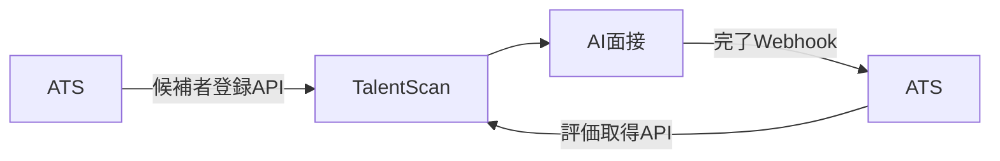

# API・JSON・Webhookによるシステム連携

## 学ぶこと

- APIを処理の境界として捉える方法
- JSONの配列、オブジェクト、項目名、値
- APIとWebhookの違い
- システム連携で確認する契約

## 前提知識

URL、HTTP method、status codeと、フロントエンド・バックエンドの責務を理解していること。

## 到達目標

- エンドポイント、method、認証、JSONを一つの契約として説明できる。
- APIを呼ぶ側とデータを持つ側を分けて考えられる。
- Webhookを使う通知型の連携を説明できる。
- 失敗時の再送や重複処理を設計項目として挙げられる。

## APIとJSON

APIは別の画面やシステムからバックエンド処理を呼ぶ入口である。JSONは、その境界を通して情報を構造化して渡す形式である。

```json
{
  "candidateId": "c-123",
  "name": "田中太郎",
  "status": "interviewed"
}
```

`{}`は一つのオブジェクト、`[]`は複数をまとめる配列である。項目名と値の意味、必須かどうか、許される形式を呼び出す側と受ける側で合わせる。

## APIの契約

| 観点 | 確認内容 |
|---|---|
| URL | どの処理を呼ぶか |
| method | 取得、作成、更新など何を依頼するか |
| 認証 | 誰の要求として許可するか |
| request | 何をどのJSON形式で渡すか |
| response | 成功時に何を返すか |
| error | 失敗をどのstatusと内容で示すか |

## APIとWebhook

APIは必要になった側が相手を呼ぶ。Webhookは変化が起きた側が、事前に登録されたURLへ通知する。



Webhookは相手が一時的に失敗することを考え、再送、署名検証、重複通知への対処が必要になる。

## 連携設計の順序

1. 何のデータを連携するか決める。
2. 現在どちらが持っているか確認する。
3. 誰が誰を呼ぶか決める。
4. いつ連携するか決める。
5. URL、method、認証、JSONを決める。
6. 成功・失敗・再送を決める。

## 理解確認

1. APIとJSONはそれぞれ何を担当するか。
2. APIとWebhookは呼び出すタイミングがどう違うか。
3. 情報を持つ側とAPIを呼ぶ側は必ず同じか。
4. Webhookの重複通知を考える必要があるのはなぜか。

## Learning Logとの対応

Day 6ではTalentScanとATSの双方向連携を整理した。Readingでは「APIの口を開ける」を、URLだけでなく認証、JSON、エラー、再送まで含む契約として定義する。
