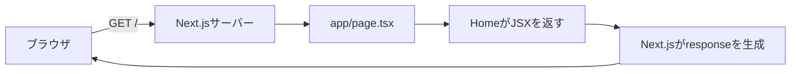

# ブラウザからServer Componentまで

## 学ぶこと

- ブラウザとサーバーの役割
- `app/page.tsx`とJSX
- Server ComponentとClient Component
- コードが実行される場所

## 前提知識

Next.jsを起動してlocalhostを開けること。HTMLの`main`、`h1`、`p`が画面の要素を表すと分かればよい。

## 到達目標

- ブラウザが`.tsx`そのものを表示しているのではないと説明できる。
- Server ComponentがNext.jsのデフォルトであると理解できる。
- 操作やstateが必要なときにClient Componentを選べる。

## requestから表示まで

ブラウザはURLを指定してページを要求する。Next.jsはURLに対応するページを実行し、Reactの結果をresponseとして返す。ブラウザが受け取るのはソースの`.tsx`ファイルではなく、Next.jsが処理した結果である。

## ServerとClientの違い

| 観点 | Server Component | Client Component |
|---|---|---|
| 指定 | デフォルト | ファイル先頭に`"use client"` |
| 主な実行場所 | サーバー | ブラウザ |
| 得意な処理 | ファイル・DB読込、秘密情報、初期表示 | クリック、state、ブラウザAPI |
| ブラウザへ送るJavaScript | 抑えやすい | 操作コードが必要 |

サーバーでできる処理までClient Componentにすると、ブラウザへ送るJavaScriptと公開範囲が増える。逆に、クリック後にstateを更新する処理はブラウザで動く必要がある。

## このリポジトリでの例

Learning HubやLearning LogのページはServer Componentで、サーバー側からMarkdownを読む。Mermaid描画は`useEffect`とブラウザ側の描画処理が必要なため、`MermaidDiagram`だけがClient Componentになっている。

## 理解確認

1. `/`を担当するファイルはどれか。
2. JSXは誰が処理するか。
3. Markdownファイルの読み込みはServerとClientのどちらに向くか。
4. クリックで表示を切り替える部品はどちらに向くか。

## Learning Logとの対応

Day 3では`app/page.tsx`を読み、ブラウザ、Next.jsサーバー、JSX、Server／Client Componentの違いを確認した。Readingでは実行場所を選ぶ判断基準まで整理する。
