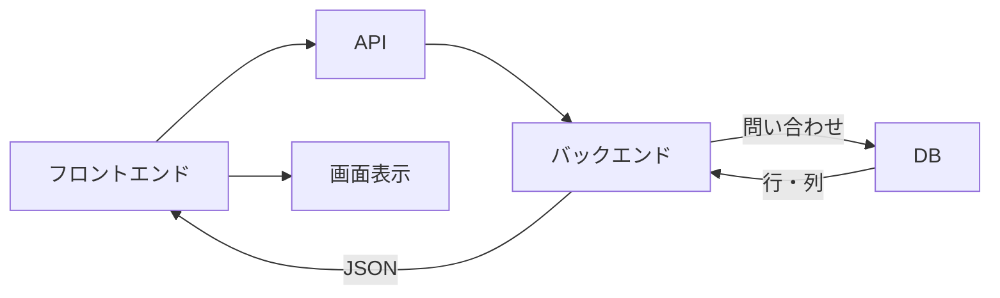

# DB・永続化・SQLの基礎

## 学ぶこと

- メモリとDBの違い
- 永続化の判断基準
- テーブル、行、列
- SELECT、INSERT、UPDATE、DELETE
- DBの結果をJSONへ変換する流れ

## 前提知識

バックエンドがAPIを通じて要求を受け、JSONを返す役割を理解していること。

## 到達目標

- 一時状態と永続データを区別できる。
- DBとJSONを別の形式・役割として説明できる。
- 単純なSELECT文を読める。
- TalentScanで保存すべきデータを理由付きで判断できる。

## メモリとDB

| 観点 | メモリ | DB |
|---|---|---|
| 保存期間 | プログラム実行中 | 再起動後・後日も再取得可能 |
| 用途 | 計算途中、画面の一時状態 | 業務データ、履歴、評価 |
| TalentScan例 | モーダルの開閉 | 候補者、回答、AI評価 |

永続化とは、データを後から再取得できる形で保存すること。「後日また必要か」「履歴や判断根拠になるか」が判断の中心になる。

## テーブルとJSON

| id | name | score |
|---:|---|---:|
| 1 | 田中太郎 | 82 |
| 2 | 山田花子 | 91 |

DBは保存と問い合わせに向いたテーブル・行・列を使う。APIは必要なデータをJSONへ整え、別のシステムやフロントエンドへ返す。DBの中身が最初からJSONであるとは限らない。

## SQLの基本

```sql
SELECT id, name, score
FROM candidates
WHERE score >= 80;
```

| SQL | 役割 |
|---|---|
| SELECT | 取得 |
| INSERT | 追加 |
| UPDATE | 更新 |
| DELETE | 削除 |

SQLはDBへ条件と操作を伝える言語である。Supabaseのライブラリ経由で書く場合も、取得するテーブル、列、条件という考え方は同じである。

## DBから画面まで



バックエンドは必要な行・列だけを取得し、権限と用途に合わせたJSONへ変換する。DBの全情報をそのままブラウザへ返す必要はない。

## 理解確認

1. 画面の開閉状態を通常DBへ保存しないのはなぜか。
2. 面接回答やAI評価をDBへ保存する理由は何か。
3. DBとJSONはどう違うか。
4. SQLのWHEREは何を指定するか。

## Learning Logとの対応

Day 7ではメモリ、DB、永続化、SQL、Supabaseの問い合わせを整理した。Readingでは、保存判断から画面表示までを一つのデータライフサイクルとして扱う。
