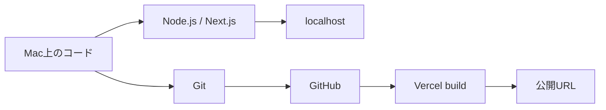

# 開発から公開まで — Next.js・Git・GitHub・Vercel

## 学ぶこと

- ローカル環境、localhost、公開環境の違い
- Node.js、pnpm、Next.jsの役割
- Git、GitHub、Vercelの役割分担
- 編集したコードが公開URLへ届くまでの流れ

## 前提知識

Finderでフォルダを開き、ターミナルでコマンドを入力できればよい。Web開発やGitの経験は前提にしない。

## 到達目標

- `pnpm dev`とVercel deployの違いを説明できる。
- commitとpushの違いを説明できる。
- 作業前にGitルートと変更状態を確認できる。
- buildとdeployを別の工程として捉えられる。

## 開発環境の全体像



`pnpm dev`はMac上で開発サーバーを起動する。localhostで見える内容は、現在のMacにあるファイルをNext.jsが処理した結果である。公開URLはVercel上にdeployされた別の成果物を表示する。

## 道具の役割

| 道具 | 役割 |
|---|---|
| Node.js | Next.jsや開発用JavaScriptを動かす実行環境 |
| pnpm | 依存パッケージとscriptを管理する |
| Next.js | ルーティング、画面処理、buildを担う |
| Git | ローカルで変更履歴をcommitとして保存する |
| GitHub | Git履歴を共有し、Pull Requestを扱う |
| Vercel | GitHub上のコードをbuildし、公開環境へdeployする |

## Gitで最初に確認すること

```bash
pwd
git rev-parse --show-toplevel
git status
```

`pwd`は現在位置、`git rev-parse --show-toplevel`はGitが管理しているルート、`git status`はbranchと未処理の変更を示す。期待するプロジェクトとGitルートが違う場合は、commitする前に止まる。

## buildとdeploy

buildはソースコードを検査・変換し、公開用の成果物を作る工程である。deployはその成果物を実行環境へ配置する工程である。buildが失敗すれば、通常は新しい成果物をdeployできない。

## 理解確認

1. localhostとVercelの公開URLは何が違うか。
2. commitしただけでGitHubへ変更が届くか。
3. Gitルートを確認せずに作業するリスクは何か。
4. buildとdeployはそれぞれ何をするか。

## Learning Logとの対応

Day 1では、このリポジトリを作成し、Next.jsの開発環境、GitHubへのpush、Vercel公開までを実際に通した。Readingでは、その作業を別のプロジェクトでも再現できる概念へ整理する。
