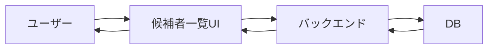

# フロントエンドとバックエンドの責務境界

## 学ぶこと

- フロントエンドとバックエンドの主な役割
- 一つの機能の中で責務を分ける考え方
- 秘密情報と重要処理を保護する理由
- TalentScanの候補者一覧を例にしたデータフロー

## 前提知識

ブラウザとサーバーがHTTPで通信し、Server ComponentとClient Componentで実行場所が異なること。

## 到達目標

- 画面表示とデータ取得を別の責務として捉えられる。
- DB操作、認証、Bedrock呼び出しをバックエンドへ置く理由を説明できる。
- 機能名だけでなく処理単位で担当を判断できる。

## 基本の役割

| 観点 | フロントエンド | バックエンド |
|---|---|---|
| 利用者との接点 | 表示、入力、クリック | APIなどを通じて要求を受ける |
| データ | 受け取ったデータを画面へ変換 | DBから取得し、検証して返す |
| 秘密情報 | 原則として持たせない | APIキーや認証情報を保護する |
| 外部連携 | 結果を利用する | DB、Bedrock、ATSを呼び出す |

フロントエンドにも入力確認や並び替えなどの処理はある。処理があるかどうかではなく、利用者へ見せてよいか、権限確認が必要か、永続データを変更するかで判断する。

## 候補者一覧の責務分担

「候補者一覧」という一つの機能でも、バックエンドは取得と権限確認、フロントエンドは行やカードへの表示を担当する。両方を一つの曖昧な処理として扱わない。

## バックエンドを経由する理由

ブラウザへDBの管理権限やBedrockの認証情報を渡すと、利用者が内容を確認・再利用できてしまう。バックエンドを入口にすれば、認証、入力検証、利用範囲、監査、エラー処理を集約できる。

## 判断の質問

- 利用者のブラウザへ見せてよい情報か。
- 誰が実行してよいかを確認する必要があるか。
- DBや外部サービスの秘密情報を使うか。
- 再起動後も残すデータを変更するか。
- 失敗時の再試行や監査が必要か。

## 理解確認

1. 候補者一覧の取得と表示はそれぞれ誰が担当するか。
2. 入力チェックは必ずバックエンドだけで行えばよいか。
3. BedrockのAPIキーをブラウザへ置かない理由は何か。
4. 一つの機能の中で責務を分ける利点は何か。

## Learning Logとの対応

Day 5では`app/page.tsx`とTalentScanの具体例から役割を分類した。Readingでは、安全性と責務境界を基準に、未知の機能でも配置を判断できる形へ広げる。
