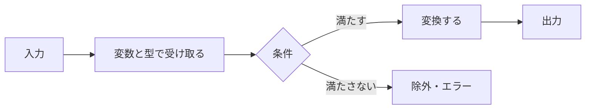

# JavaScript／TypeScriptの値と処理を読む

## このLessonで答えられるようになる問い

- コードのどこがデータで、どこが処理なのか。
- 配列とオブジェクトはTalentScanの候補者データをどう表すのか。
- `async`と`await`がある関数は何を待っているのか。

## なぜFDEに必要か

API、React、DB、Bedrockのコードは、最終的に値を受け取り、条件を確認し、別の形へ変換して返す処理である。基本構文を「記号の暗記」ではなくデータフローとして読めれば、実装の詳細が分からなくても処理の意図を説明できる。

## 基本概念

| 概念 | 役割 | 例 |
|---|---|---|
| 変数 | 値へ名前を付ける | `const candidateName = "田中"` |
| 文字列 | 文字データ | `"completed"` |
| 数値 | 件数や点数 | `82` |
| 真偽値 | yes／noの状態 | `true` |
| 配列 | 複数の値を順序付きで持つ | `candidates` |
| オブジェクト | 項目名と値の組で1件を表す | `{ id: 1, name: "田中" }` |
| 関数 | 入力から処理結果を作る | `getCandidate(id)` |
| 型 | 値の形を明示する | `Candidate` |

条件分岐は状況によって処理を変え、繰り返しは複数データへ同じ処理を適用する。

## システム内部で実際に起きること

次のコードは、候補者配列から合格点以上の人だけを選び、表示用の文字列へ変える。

```ts
type Candidate = {
  id: number;
  name: string;
  score: number;
};

function approvedNames(candidates: Candidate[], threshold: number) {
  return candidates
    .filter((candidate) => candidate.score >= threshold)
    .map((candidate) => candidate.name);
}
```

入力は`candidates`と`threshold`、処理は`filter`と`map`、出力は名前の配列である。TypeScriptの型は、各候補者がどの項目を持つかをコード上で確認できるようにする。

## TalentScanでの具体例

APIから候補者を取得する処理には時間がかかるため、非同期関数になる。

```ts
async function loadCandidates() {
  const response = await fetch("/api/candidates");

  if (!response.ok) {
    throw new Error("候補者を取得できませんでした");
  }

  const candidates = await response.json();
  return candidates;
}
```

`await`は処理全体を永久に止める命令ではなく、その非同期関数の中で結果が利用可能になるまで待つ。失敗時には条件分岐でエラーを投げ、成功時にはJSONを値へ変換して返す。

## 処理フローまたは構成図



コードを読むときは、細かな構文より先に入力、条件、繰り返し、出力を探す。

## よくある誤解

- `const`は値が一切変わらない：変数への再代入を禁止するが、オブジェクト内部の変更まで自動的に禁止するわけではない。
- 型があれば実行時の不正データも防げる：型検査とAPI入力の実行時検証は別である。
- `map`はDBのマッピング機能：ここでは配列の各要素を別の値へ変換するJavaScriptの処理である。
- `await`を書けば失敗しない：失敗、timeout、例外は別に処理する必要がある。
- オブジェクトとJSONは同じ：見た目は似るが、JSONは通信・保存用の文字列表現である。

## FDEとして顧客に確認すべきこと

- 入力項目の型と必須・任意は何か。
- 配列が0件の場合にどう表示するか。
- 条件分岐になる業務ルールは何か。
- 外部から来る値をどこで検証するか。
- 非同期処理を待つ間、利用者へ何を表示するか。

## 理解確認問題

1. 配列とオブジェクトの違いを候補者データで説明してください。
2. 関数の入力と出力はどこを見れば分かりますか。
3. TypeScriptの型とAPI入力検証はなぜ別に必要ですか。
4. `await fetch(...)`では何を待っていますか。

## ミニ演習

次の候補者から`status`が`"completed"`の人だけを選び、名前の配列を返す処理を日本語またはTypeScriptで書いてください。

```ts
const candidates = [
  { id: 1, name: "田中", status: "completed" },
  { id: 2, name: "佐藤", status: "pending" },
  { id: 3, name: "鈴木", status: "completed" },
];
```

入力、条件、繰り返し、出力もそれぞれ明記してください。

## 学習ログへ記録する項目

- 配列とオブジェクトを説明した自分の言葉
- 読めた型定義
- 関数の入力・処理・出力
- `async`／`await`について残った疑問
- ミニ演習の回答
