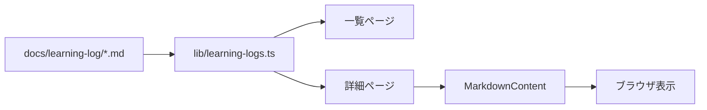
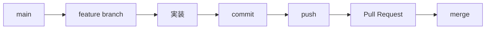

# Markdown駆動の学習ポータルとPull Request

## 学ぶこと

- App Routerのファイルベースルーティング
- Markdownをデータとして読む流れ
- 動的ルートと静的生成
- branch、commit、push、Pull Request、mergeの関係

## 前提知識

Reading 1の内容を理解し、ローカルと公開環境、commitとpushを区別できること。

## 到達目標

- `docs/learning-log`から詳細ページまでのデータフローを説明できる。
- `[date]`がURLの可変部分を表すと理解できる。
- feature branchとPull Requestが変更を分離する仕組みを説明できる。

## Markdownから画面まで

一覧ページへ日付を直接書くのではなく、loaderがディレクトリを列挙する。規則に合うMarkdownを追加すれば、一覧と静的生成の対象が増える。この方式ではMarkdownがコンテンツの保存場所、TypeScriptが読み込みと表示の規則になる。

## App Routerの対応

| ファイル | URL |
|---|---|
| `app/learning/page.tsx` | `/learning` |
| `app/learning/logs/page.tsx` | `/learning/logs` |
| `app/learning/logs/[date]/page.tsx` | `/learning/logs/2026-07-12`など |

`[date]`は固定文字ではなくパラメータ名である。詳細ページは受け取った日付を使ってMarkdownを探し、存在しない場合は404を返す。

## 静的生成

`generateStaticParams()`はbuild時に存在する日付を列挙する。これによりNext.jsは、既知の詳細ページをあらかじめ生成できる。新しいMarkdownを公開版へ反映するには、そのファイルを含むcommitを再びbuild・deployする必要がある。

## Pull Requestの流れ

feature branchは作業中の変更を`main`から分ける。Pull Requestは単なるmergeボタンではなく、差分、説明、検証結果、レビューを一つの単位で扱う場所である。

## 理解確認

1. 新しいLearning Logが一覧へ自動的に現れるのはなぜか。
2. `[date]`は何を表すか。
3. commitとPull Requestの役割はどう違うか。
4. Markdownを追加した後、なぜ再deployが必要か。

## Learning Logとの対応

Day 2ではLearning Hubを実装し、feature branchからPull Request #1を経由して`main`へmergeした。Readingではコンテンツ表示とGitHub開発フローを一つの変更のライフサイクルとして結び直す。
