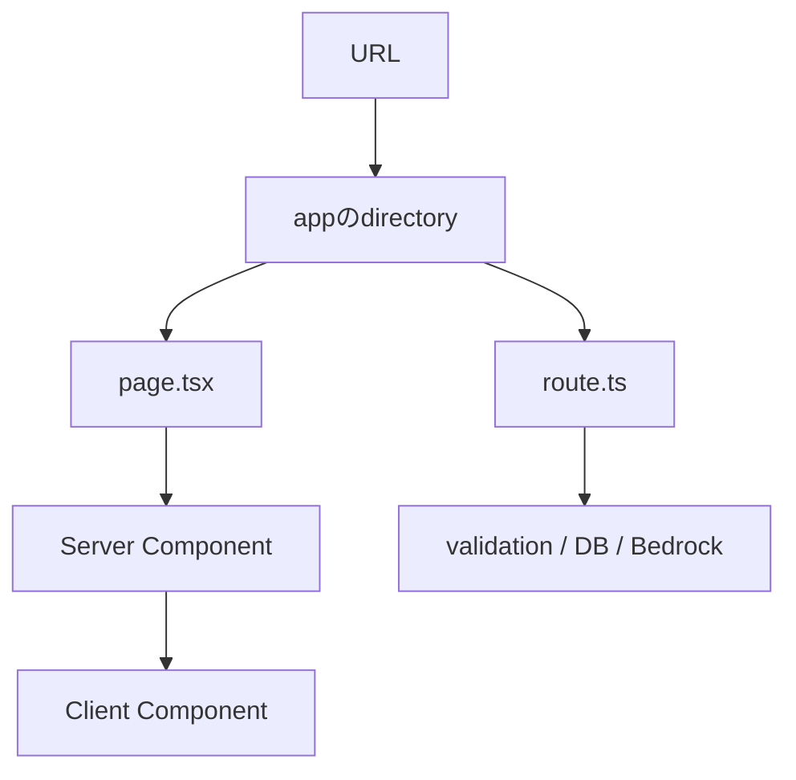

# Next.jsでページ・API・実行場所を探す

## このLessonで解けるようになる問い

- URLは`app`内のどのファイルへ対応するのか。
- Server ComponentとClient Componentは何を基準に選ぶのか。
- API endpointはNext.jsのどこへ実装するのか。

## なぜFDEに必要か

Next.jsでは画面とサーバー処理を同じリポジトリで扱える。そのため「frontend repositoryかbackend repositoryか」だけでは処理場所を判断できない。URL、特別なファイル名、`"use client"`、import先を使って実行場所を読み分ける必要がある。

## 基本概念

| 概念 | 役割 |
|---|---|
| App Router | `app`のディレクトリ構造でrouteを表す仕組み |
| `page.tsx` | 対応URLのページを定義する |
| `layout.tsx` | 配下ページで共有するレイアウト |
| `[id]` | URLの一部を値として受け取る動的route |
| Server Component | デフォルトでサーバー上にあるReact component |
| Client Component | `"use client"`を付け、ブラウザ側の操作やstateを扱うcomponent |
| `route.ts` | HTTP methodを受けるRoute Handler |
| 環境変数 | 環境ごとに変わる設定や秘密情報をコード外から渡す仕組み |

## システム内部で実際に起きること

`/learning/readings/project-files-and-imports`を開くと、`app/learning/readings/[slug]/page.tsx`が使われる。`slug`へURLの値が入り、サーバー側でMarkdownを読み込む。ページ内のMermaid図はブラウザ機能が必要なため、`"use client"`を持つcomponentへ処理を分けている。

画面表示の初期データ取得はServer Componentで行い、クリックやstateが必要な小さな部分だけClient Componentにする、という分け方ができる。

## TalentScanでの具体例

候補者一覧と詳細、登録APIを作る場合、次のような対応になる。

```text
app/candidates/page.tsx             → GET /candidates の画面
app/candidates/[id]/page.tsx        → GET /candidates/123 の画面
app/api/candidates/route.ts         → /api/candidates のAPI
app/api/candidates/[id]/route.ts    → /api/candidates/123 のAPI
```

`route.ts`では`GET`や`POST`という名前の関数をexportし、入力検証、認証、DB処理などへつなぐ。APIキーやDB接続情報はブラウザへ公開せず、サーバーだけで読む環境変数に置く。

## 処理フローまたは構成図



同じ`app`配下でも、ページ表示とAPI入口、サーバー実行とブラウザ実行は別の責務である。

## よくある誤解

- `app`配下はすべてブラウザで動く：Server ComponentとRoute Handlerはサーバーで動く。
- `"use client"`をページ全体へ付けるのが安全：ブラウザへ送るJavaScriptと公開範囲が増えるため、必要な境界だけに付ける。
- Server ComponentからClient Componentを使えない：propsとして表示に必要なデータを渡せる。
- 環境変数なら必ず秘密になる：ブラウザ公開用の変数やコードへの埋め込み方に注意が必要である。
- URLとファイル名は常に完全一致する：動的routeやroute groupなどの仕組みがある。

## FDEとして顧客に確認すべきこと

- その要件は新しい画面、既存画面変更、API追加のどれか。
- URLに含める識別子と権限確認は何か。
- ブラウザで即座に反応すべき操作は何か。
- サーバーだけで扱う秘密情報は何か。
- 開発・検証・本番で変わる環境変数は何か。

## 理解確認問題

1. `/learning/logs/2026-07-18`に対応する動的routeを説明してください。
2. Server ComponentとClient Componentの違いは何ですか。
3. 候補者登録APIを置くファイル例を答えてください。
4. Bedrockの認証情報をClient Componentに置かない理由は何ですか。

## ミニ演習

TalentScanへ次の機能を追加すると仮定し、必要なファイル候補を書いてください。

> 候補者詳細画面で「AI評価を実行」を押し、APIがBedrockを呼んで結果を返す。

最低限、次を含めます。

- 候補者詳細ページ
- クリックを扱うClient Component
- AI評価APIのRoute Handler
- Bedrock呼び出しを置くサーバー側ファイル
- 利用する環境変数

## 学習ログへ記録する項目

- URLとファイルの対応例
- Server／Clientを分けた理由
- Route Handlerの役割
- 環境変数として管理すべき値
- ミニ演習で作ったファイル構成
- Week 3へ進む前に読めるようになった既存コード
