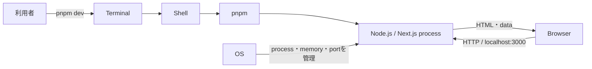

# OS・ターミナル・プロセスを理解する

## このLessonで解けるようになる問い

- ターミナルへ入力したコマンドは、誰が解釈して実行するのか。
- `pnpm dev`を実行すると、なぜブラウザから`localhost`を開けるのか。
- 「portが使用中」「コマンドが見つからない」と表示されたとき、最初に何を確認するのか。
- 実行中の開発serverを、どのように安全に停止するのか。

## なぜFDEに必要か

FDEは顧客環境で、アプリの起動、設定確認、ログ調査、障害の切り分けを行う。コードが正しくても、別のディレクトリでコマンドを実行した、必要なprocessが止まっている、同じportを別processが使っている、といった理由でアプリは動かない。

この層を理解すると、エラーをすぐコードの問題だと決めつけず、「どこで」「何が」「どの設定で」動いているかを証拠から確認できる。

## 基本概念

| 概念 | 役割 | TalentScan開発での例 |
|---|---|---|
| OS | ファイル、メモリ、process、networkなどを管理する | macOSがNode.js processへCPUやportを割り当てる |
| terminal | shellへ文字を入力し、結果を表示する画面 | Terminal.app、Codexのterminal |
| shell | 入力されたコマンドを解釈してprogramを起動する | `pwd`や`pnpm dev`を解釈する |
| current working directory | コマンドが基準にする現在地 | repository root |
| process | 実行中のprogramの単位 | Next.js development server |
| PID | processを識別する番号 | `ps`や`lsof`で表示される番号 |
| port | 同じcomputer上の通信先を区別する番号 | Next.jsが使う`3000` |
| environment variable | processへ外部から渡す設定 | API keyや接続先URL |

ファイルは保存された命令やデータであり、processはそのprogramが実行中になった状態である。同じprogramから複数のprocessを起動することもできる。

## システム内部で実際に起きること

repository rootで`pnpm dev`を入力すると、概ね次の順序で処理される。

1. terminalが入力をshellへ渡す。
2. shellが現在地と`PATH`を使って`pnpm`を探す。
3. pnpmが`package.json`の`dev` scriptを読む。
4. OSがNode.js／Next.jsを新しいprocessとして起動する。
5. processが設定されたportでHTTP requestを待つ。
6. ブラウザが`localhost`へrequestを送り、Next.js processがresponseを返す。

terminalを閉じたり、processへ終了signalを送ったりすると、その開発serverはrequestを受けられなくなる。ブラウザのtabを閉じるだけではserver processは止まらない。

## TalentScanでの具体例

最初に現在地とrepositoryの内容を確認する。

```bash
pwd
ls
```

`package.json`が見えるrepository rootで、開発serverを起動する。

```bash
pnpm dev
```

別のterminalから、port `3000`を使っているprocessを確認できる。

```bash
lsof -i :3000
```

より広くprocessを探す場合は、一覧からNode.jsやNext.jsに関係する行を確認する。

```bash
ps
```

起動したterminalが手元にある場合は、そこで`Control + C`を入力して停止するのが基本である。別terminalから停止する必要がある場合だけ、対象を十分確認してから表示されたPIDを指定する。

```bash
kill PID
```

`PID`は文字のまま入力せず、`lsof`などで確認した対象processの番号へ置き換える。終了対象が不明な状態で実行しない。

## 処理フローまたは構成図



重要なのは、terminal、shell、server process、browserが別の役割を持つことである。terminalに表示が残っていてもprocessが停止している場合があり、browserに古い画面が残っていてもserverが動いているとは限らない。

## よくある誤解

### terminalとshellは同じ

terminalは入出力の画面、shellはコマンドを解釈するprogramである。見た目は一体でも役割が違う。

### browserを閉じればserverも止まる

browserとserverは別processである。browserを閉じても、serverはportで待ち続ける。

### `localhost`はinternet上の共有環境

`localhost`は原則として自分のcomputer自身を指す。他の人が同じURLを開いても、自分のMac上のserverへはつながらない。

### port使用中なら数字を変えれば解決する

別portで起動できても、古いserverが残った原因は解決していない。まず対象processを特定し、必要なprocessか判断する。

### terminalのエラーはすべてコードの不具合

現在地、commandの有無、依存関係、環境変数、process、portにも原因がある。表示された事実から層を切り分ける。

## FDEとして顧客に確認すべきこと

- どのOS、shell、Node.js／package manager versionを使っているか。
- どのディレクトリで、どのコマンドを実行したか。
- 起動に必要な環境変数は、どの環境へ設定されているか。
- 使用するhost・portと、network上の公開範囲は何か。
- processの起動、停止、再起動を誰がどの手順で行うか。
- 障害時に確認できるlog、監視、連絡先は何か。

顧客から「動きません」と聞いたら、操作、時刻、環境、実行コマンド、完全なerror message、直前の変更を順に確認する。

## 理解確認問題

1. terminal、shell、processの役割を一文ずつ説明してください。
2. `pnpm dev`を実行するディレクトリが重要なのはなぜですか。
3. browserを閉じてもport `3000`が使用中になることがあるのはなぜですか。
4. `lsof -i :3000`で分かることと、分からないことは何ですか。
5. API keyをsource codeへ直接書かず、環境変数としてprocessへ渡す理由を説明してください。

## ミニ演習

1. terminalでrepository rootを開き、`pwd`で絶対pathを記録する。
2. `ls`を実行し、`package.json`、`app`、`lib`、`docs`があることを確認する。
3. `pnpm dev`で開発serverを起動し、表示されたURLとportを記録する。
4. browserでLearning Hubを開く。
5. 別terminalで`lsof -i :3000`を実行し、command名とPIDを確認する。
6. serverを起動したterminalで`Control + C`を入力する。
7. 同じURLへ再読込し、server停止時の症状を確認する。

実行環境でportが異なる場合は、起動時に表示された番号へ読み替える。演習中に見つけた別processは、所有者と用途が分からない限り停止しない。

## 学習ログへ記録する項目

- 実行日と使用したOS・shell。
- repository rootの絶対path。
- `pnpm dev`からNext.js process起動までの説明。
- 使用したportと、確認できたcommand名・PID。
- server起動中と停止後でbrowserに現れた違い。
- 理解確認問題で説明しにくかった概念。
- 顧客環境で同じ問題を調べるときに、最初に集める証拠。
