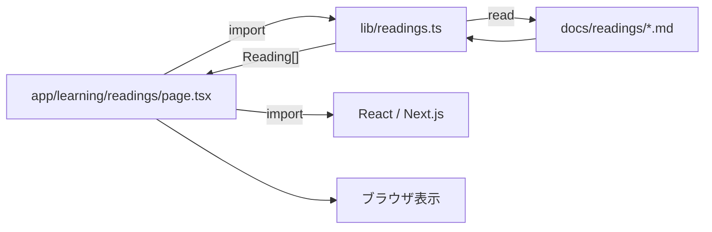

# ファイルとディレクトリから処理の場所を探す

## このLessonで解けるようになる問い

- 画面を変更したいとき、最初にどのディレクトリを見るのか。
- `app`、`components`、`lib`、`docs`はどう役割が違うのか。
- `import`と`export`は、別ファイルの処理をどうつなぐのか。

## なぜFDEに必要か

FDEはすべてのコードを暗記する必要はないが、顧客要件に関係する場所を見つける必要がある。「候補者一覧の表示を変える」「APIの入力チェックを確認する」と言われたとき、リポジトリ全体から関係ファイルを絞れれば、エンジニアやCodexへ具体的に依頼できる。

## 基本概念

ファイルはコードや文章を保存する単位、ディレクトリはファイルを役割ごとに整理する入れ物である。このリポジトリでは、主に次の役割へ分かれている。

| 場所 | 役割 | 例 |
|---|---|---|
| `app` | URLに対応するページと共通レイアウト | `app/learning/page.tsx` |
| `components` | 複数画面から使える表示部品 | `components/markdown-content.tsx` |
| `lib` | データ読込、変換、業務ロジック | `lib/readings.ts` |
| `public` | ブラウザへ配信する画像など | `public/next.svg` |
| `docs` | Learning LogやReadingの本文データ | `docs/readings/*.md` |
| ルートの設定ファイル | build、型、依存関係などの設定 | `package.json`、`tsconfig.json` |

## システム内部で実際に起きること

`/learning/readings`を開くと、Next.jsは`app/learning/readings/page.tsx`をページとして使う。そのファイルは`lib/readings.ts`から`getReadings`をimportする。`getReadings`は`docs/readings`のMarkdownを読み、ページへ返す。ページは受け取ったデータをReact要素へ変換する。

```text
URL
→ appのpage.tsx
→ libの読込処理
→ docsのMarkdown
→ page.tsxへデータが戻る
→ componentsで表示
```

`app`だけですべてを処理せず、読込や表示部品を別ファイルへ分けることで責務を明確にしている。

## TalentScanでの具体例

候補者一覧を探す場合は、次の順で調べる。

1. 候補者一覧のURLを確認する。
2. `app`でURLに対応する`page.tsx`を探す。
3. そのファイルの`import`を読み、利用しているcomponentやlibを確認する。
4. API呼び出し、DB取得、型定義が別ファイルなら参照先へ移動する。
5. 表示項目とデータ項目の対応を確認する。

「candidate」という単語だけを全体検索する方法も有効だが、URLとimportを順に追うと処理のつながりを失いにくい。

## 処理フローまたは構成図



`import`は「このファイルの中へコードを複製する」という意味ではなく、別ファイルが公開した機能を参照できるようにする宣言である。

## よくある誤解

- `app`にバックエンド処理は置けない：Next.jsではServer ComponentやRoute Handlerも`app`配下に置ける。
- `components`は見た目だけ：状態やイベントを持つcomponentもあるが、責務を小さく保つことが重要である。
- `lib`という名前はNext.jsの必須仕様：慣習的な名前であり、プロジェクトごとに構成は異なる。
- import元を見なくても処理が分かる：重要な処理が別ファイルにあるため、参照先を追う必要がある。
- ファイル名だけで動作が決まる：`app`の特別なファイル名以外は、名前よりexportと利用箇所が重要である。

## FDEとして顧客に確認すべきこと

- 変更対象は画面、処理、データ、設定のどれか。
- 同じ部品が複数画面で共通利用されているか。
- 顧客別の設定はコード、DB、環境変数のどこにあるか。
- 変更すると影響を受けるURLや利用者は誰か。
- 実システムのディレクトリ規約と責任者はどう決まっているか。

## 理解確認問題

1. `/learning/readings`の画面ファイルはどこにありますか。
2. Markdownを読み込む処理とMarkdown本文はそれぞれどこにありますか。
3. `components`と`lib`の主な違いは何ですか。
4. importを見たあとに何を確認すべきですか。

## ミニ演習

このリポジトリで、学習ログ詳細が表示されるまでのファイルを探してください。

1. `/learning/logs/2026-07-18`に対応する`page.tsx`
2. Learning Logを読み込む`lib`ファイル
3. MarkdownをReactへ変換するcomponent
4. 元になるMarkdown

見つけた4ファイルを矢印で結び、それぞれの責務を1文で書いてください。

## 学習ログへ記録する項目

- 探したURL
- 最初に開いたファイル
- importをたどった順序
- 各ファイルの責務
- 探す途中で迷ったディレクトリ
- TalentScan本体で次に探したい画面または処理
