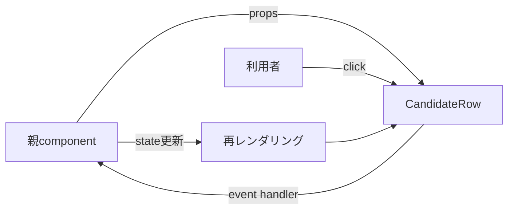

# Reactのコンポーネント・props・stateを読む

## このLessonで解けるようになる問い

- React componentは通常の関数と何が違うのか。
- propsとstateは、どちらもデータなのになぜ分けるのか。
- ボタンを押したあと、なぜ画面が更新されるのか。

## なぜFDEに必要か

顧客要件の多くは、項目追加、表示条件、フォーム、ボタン、一覧など画面の変更として現れる。Reactの基本を読めれば、その変更がデータ取得の問題か、画面部品の問題か、状態管理の問題かを切り分けられる。

## 基本概念

| 概念 | 意味 |
|---|---|
| component | JSXを返す再利用可能な画面部品 |
| props | 親componentから渡される外部入力 |
| state | component内部で変化を保持する値 |
| event | clickや入力変更など利用者の操作 |
| 再レンダリング | propsやstateの変化に応じて表示を再計算すること |
| form | 利用者の入力をまとめて送信する仕組み |

componentは関数として書かれることが多いが、Reactがその戻り値を画面構造として扱う点が重要である。

## システム内部で実際に起きること

親componentは候補者データをpropsとして行componentへ渡す。行componentはpropsを使って名前や状態を表示する。利用者が選択ボタンを押すとevent handlerが呼ばれ、stateが変わる。Reactは新しいstateを使って表示を再計算する。

DOMを一行ずつ手作業で変更するのではなく、「このデータならこの表示」という関係をcomponentとして宣言する。

## TalentScanでの具体例

```tsx
type CandidateRowProps = {
  name: string;
  score: number | null;
  onSelect: () => void;
};

function CandidateRow({ name, score, onSelect }: CandidateRowProps) {
  return (
    <button onClick={onSelect}>
      <strong>{name}</strong>
      <span>{score ?? "評価待ち"}</span>
    </button>
  );
}
```

`name`、`score`、`onSelect`は親から渡されるpropsである。`onClick`はクリックeventと処理をつなぐ。`score`が`null`なら「評価待ち」を表示する。

## 処理フローまたは構成図



データは親から子へ渡り、操作はcallbackによって子から親へ通知されることが多い。

## よくある誤解

- propsはcomponent内部で自由に書き換える：propsは親から受け取る入力として扱う。
- stateはDB保存と同じ：stateは主に画面が動作中の状態で、再読み込み後も残すには別の保存が必要である。
- 再レンダリングはページ全体の再読み込み：Reactが必要な表示を再計算することで、ブラウザのreloadとは異なる。
- すべてを一つのcomponentへ書く方が簡単：変更範囲と再利用性を考えて責務を分ける。
- form入力は自動的にAPIへ保存される：送信処理とAPI呼び出しを実装する必要がある。

## FDEとして顧客に確認すべきこと

- 一覧に必要な表示項目は何か。
- どの操作でstateが変わるか。
- 変更を画面内だけに保持するか、DBへ保存するか。
- 0件、読込中、失敗時に何を表示するか。
- 共通componentと顧客別表示をどこで分けるか。

## 理解確認問題

1. propsとstateの違いを説明してください。
2. `onClick={onSelect}`は何をつないでいますか。
3. state更新後に表示が変わる仕組みを説明してください。
4. 画面の並び替えstateと候補者DBの違いは何ですか。

## ミニ演習

候補者一覧に「評価済みのみ表示」チェックボックスを追加すると仮定します。次を整理してください。

- componentへ渡すprops
- component内部で持つstate
- 発生するevent
- 配列へ適用する条件
- DB保存が必要かどうかと理由

可能なら、親componentと一覧componentの二つに分けて図を描いてください。

## 学習ログへ記録する項目

- component、props、state、eventの説明
- 読んだReact componentのファイル
- データが親から子へ渡る経路
- stateとDBを混同しそうになった箇所
- ミニ演習の設計
