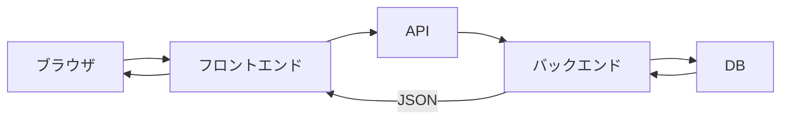
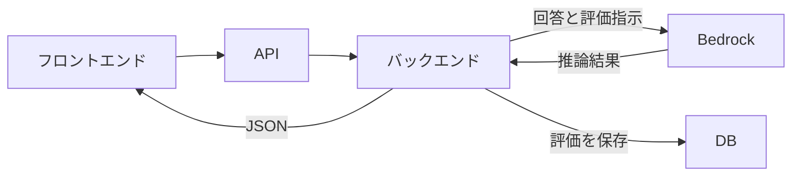

# TalentScanアーキテクチャ入門

## 学ぶこと

- TalentScanを構成する7要素
- API、バックエンド、DB、JSONの関係
- 保存済みデータを取得する流れ
- Bedrockで新しい評価を生成して保存する流れ
- 各要素の責務境界

## 前提知識

Reading 3〜7を読み、HTTP、フロントエンド／バックエンド、API、JSON、DB、永続化を区別できること。

## 到達目標

- 7要素を処理場所、入口、保存場所、データ形式に分類できる。
- 候補者一覧取得を順番に説明できる。
- AI評価生成と保存を順番に説明できる。
- BedrockがDB保存を担当しない理由を説明できる。

## 7要素の役割

| 要素 | 役割 |
|---|---|
| ブラウザ | ページを取得し、表示・操作する |
| フロントエンド | 利用者向けの画面と操作を担う |
| API | バックエンド処理を呼ぶ入口になる |
| バックエンド | 検証、取得、保存、外部呼び出しを行う |
| DB | 必要なデータを永続保存する |
| JSON | 境界を越えてデータを渡す形式になる |
| Bedrock | AWS上の生成AIモデルを呼び出す基盤になる |

APIは処理主体ではなく入口、JSONは処理場所ではなく形式、DBは保管場所である。Bedrockは推論結果を返すが、TalentScanの業務データを直接管理しない。

## 候補者一覧取得

これは保存済みデータを取得して表示する流れである。バックエンドは権限を確認し、必要な候補者だけを取得し、画面用のJSONへ整える。

## AI評価生成・保存

これは新しいデータを生成して保存する流れである。バックエンドが入力と権限を検証し、Bedrockへ推論を依頼し、返された結果を業務データへ整えてDBへ保存する。

## 二つの流れを比べる

| 観点 | 候補者一覧 | AI評価 |
|---|---|---|
| 起点 | 保存済みデータの閲覧 | 新しい評価の実行 |
| 主な外部処理 | DBから取得 | Bedrockで生成 |
| DB操作 | 読み取り | 保存 |
| 最終表示 | 候補者の一覧 | 評価結果と状態 |

## 理解確認

1. APIとバックエンドの違いは何か。
2. DBの結果がバックエンドを通って画面へ戻るのはなぜか。
3. Bedrockから直接DBへ保存しないのはなぜか。
4. 候補者一覧とAI評価でDB操作はどう違うか。

## Learning Logとの対応

Day 8では7要素と二つのデータフローを構造分解した。Readingでは、各要素を単語として覚えるのではなく、責務とデータの移動で説明できる状態を目指す。
