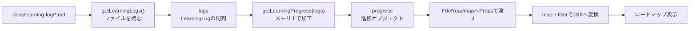

# TalentScan実コードの構文・関数・API

## このGuideの位置づけ

このGuideは、2026-08-04に学習ページの実コードで確認した要素を、日付に依存せず参照できる形で整理したものである。必須Lessonを増やすものではなく、コードを読むときに必要な項目を引くためのPractice Guideとして扱う。

ここで扱うものを一律に「ターミナルコマンド」とは呼ばない。

| 分類 | 該当する要素 |
|---|---|
| JavaScript／TypeScriptの構文・キーワード | `import`、`export`、`type`、`const`、`async`、`await`など |
| 配列・Set・文字列のメソッド | `map`、`filter`、`find`、`has`、`split`など |
| JavaScriptの非同期処理 | `Promise.all` |
| このリポジトリの関数 | `getLearningLogs`、`getReadings`、`getLearningProgress` |
| Node.js API | `fs.readdir`、`fs.readFile`、`path.join`、`process.cwd` |
| Reactで画面を作る要素 | JSX、Component、Props |

2026-08-04の学習中にターミナルコマンドを実行した記録はない。確認したのは、実在するTypeScript／TSXコードである。

## 先に処理全体をつかむ

細かな構文を読む前に、データがどこから来て、どこで加工され、どこで表示へ変わるかを確認する。



処理は、次の5段階に分けて読む。

```text
1. ファイルと型をつなぐ
2. 必要なデータを読み込む
3. 読み込んだ値を整える
4. 進捗表示用の値へ加工する
5. Propsで渡してJSXへ変換する
```

## 1. ファイルと型をつなぐ

### `import`

| 観点 | 内容 |
|---|---|
| 何をするものか | 別ファイルで`export`された値、関数、Componentを現在のファイルで利用できるようにする。 |
| 今回の用途 | `page.tsx`が`FdeRoadmap` Componentや`getLearningLogs`関数を読み込む。 |
| 処理上の位置 | ファイル間の依存関係をつなぐ。importしただけでAPI通信や関数実行が行われるとは限らない。 |

```ts
import { FdeRoadmap } from "@/components/fde-roadmap";
import { getLearningLogs } from "@/lib/learning-logs";
```

### `import type`

| 観点 | 内容 |
|---|---|
| 何をするものか | 実行時の値ではなく、型情報としてだけ別ファイルを参照する。 |
| 今回の用途 | `getLearningProgress`の戻り値型を`Progress`型として再利用する。 |
| 処理上の位置 | 型の接続。これによって`getLearningProgress`が実行されるわけではない。 |

```ts
import type { getLearningProgress } from "@/lib/learning-roadmap";
```

### `export`

| 観点 | 内容 |
|---|---|
| 何をするものか | 関数、型、Componentなどを別ファイルからimportできるように公開する。 |
| 今回の用途 | `FdeRoadmap`や`getLearningLogs`を他ファイルから利用可能にする。 |
| 処理上の位置 | ファイルの外へ公開する境界。データ加工そのものではない。 |

```ts
export function FdeRoadmap(...) {
```

```ts
export async function getLearningLogs() {
```

`export`と`map`の役割は分けて考える。

```text
export → 外部から利用可能にする
map・filter・進捗率計算 → 受け取ったデータを加工する
```

### `type`と`ReturnType`

`type`は、値が持つ項目と型を定義する。型定義自体がファイル読込や画面表示を実行するわけではない。

```ts
type Progress = ReturnType<typeof getLearningProgress>;
```

| 要素 | 何をするものか | 今回の用途 | 処理上の位置 |
|---|---|---|---|
| `type` | データの形へ名前を付ける | `progress`や学習ログの構造を明確にする | 実行前の型検査を助ける |
| `ReturnType` | 関数の戻り値と同じ型を取り出すTypeScriptのユーティリティ型 | `getLearningProgress`の戻り値型を`Progress`として再利用する | 重複した型定義を避ける |

### `const`

`const`は、変数へ値を代入し、その変数への再代入を行わないことを示す。

```ts
const progress = getLearningProgress(logs);
const latest = logs[0] ?? null;
```

今回のコードでは、`logs`、`progress`、`stats`、`latest`など、処理途中の値へ名前を付けている。`const`はオブジェクト内部まで自動的に変更不能にする仕組みではない。

## 2. 必要なデータを読み込む

### `async`／`await`

| 要素 | 何をするものか | 今回の用途 | 処理上の位置 |
|---|---|---|---|
| `async` | Promiseを返す非同期関数を定義する | `LearningPage`やファイル読込関数を非同期処理として定義する | 読込を含む関数の入口 |
| `await` | Promiseが完了し、結果を利用できるまで非同期関数内で待つ | Markdownや教材データの読込完了後に次の処理へ進む | 読込結果を受け取る地点 |

```ts
export default async function LearningPage() {
  const [logs, readings] = await Promise.all([
    getLearningLogs(),
    getReadings(),
  ]);
}
```

`async`があっても、外部APIを呼んでいるとは限らない。今回待っている主な処理は、サーバー上でのMarkdownファイル読込である。

### `Promise.all`と配列の分割代入

`getLearningLogs()`と`getReadings()`は互いの結果に依存しないため、`Promise.all`で両方を開始し、すべての完了を待つ。

```ts
const [logs, readings] = await Promise.all([
  getLearningLogs(),
  getReadings(),
]);
```

| 要素 | 何をするものか | 今回の用途 | 処理上の位置 |
|---|---|---|---|
| `Promise.all` | 複数のPromiseをまとめて開始し、すべての完了結果を配列で返す | ログ取得と教材取得を同時に進める | 複数の読込処理をまとめる |
| 配列の分割代入 | 配列内の値を順番に別々の変数へ代入する | 1件目を`logs`、2件目を`readings`として受け取る | 読込結果へ名前を付ける |

### このリポジトリで定義された関数

| 関数 | 入力 | 主な処理 | 出力 |
|---|---|---|---|
| `getLearningLogs()` | なし | `docs/learning-log`内の対象ファイルを探し、各Markdownを読み込む | `LearningLog[]` |
| `getReadings()` | なし | `docs/readings`内の対象ファイルを探し、教材データへ変換する | `Reading[]` |
| `getLearningProgress(logs)` | `LearningLog[]` | 完了Lessonを抽出し、章とPhaseの進捗状態を計算する | ロードマップ表示用の`progress`オブジェクト |

`get`という関数名だけでは、APIやDBから取得しているとは判断できない。関数定義を開き、今回のようにファイルを読んでいるのか、API通信しているのか、DBへ問い合わせているのかを確認する。

## 3. Markdownを読み、扱える値へ整える

### Node.jsのファイル・パスAPI

| 要素 | 何をするものか | 今回の用途 | 処理上の位置 |
|---|---|---|---|
| `process.cwd()` | Node.jsプロセスの現在の作業ディレクトリを返す | プロジェクトルートを基準にする | パスの起点を決める |
| `path.join(...)` | 複数の値をOSに合うファイルパスへ連結する | `docs/learning-log`や個別Markdownのパスを作る | 読込対象の場所を作る |
| `fs.readdir(...)` | ディレクトリ内のファイルとディレクトリの一覧を取得する | 学習ログのファイル一覧を得る | 読込候補を列挙する |
| `fs.readFile(...)` | 指定ファイルの内容を読み込む | 学習ログMarkdownをUTF-8文字列として読む | 元データを取得する |

```ts
const logsDirectory = path.join(process.cwd(), "docs", "learning-log");
const entries = await fs.readdir(logsDirectory, { withFileTypes: true });
const source = await fs.readFile(
  path.join(logsDirectory, `${date}.md`),
  "utf8",
);
```

これはAPI通信やDB取得ではなく、Node.js上でのファイル読込である。ブラウザが利用者のMacにあるMarkdownを直接読んでいるわけでもない。

### `RegExp`／`test`／`match`

```ts
const logFilePattern = /^(\d{4}-\d{2}-\d{2})\.md$/;
```

| 要素 | 何をするものか | 今回の用途 | 処理上の位置 |
|---|---|---|---|
| `RegExp` | 文字列の形式を判定・抽出するパターンを表す | `YYYY-MM-DD.md`の形式を定義する | 読込対象の条件を作る |
| `test` | 文字列がパターンに一致するかを真偽値で返す | 対象形式のファイルだけを残す | ファイルを絞り込む |
| `match` | 一致内容や括弧で囲んだ部分を取り出す | ファイル名から日付を得る | ファイル名をデータへ変換する |

### `split`／`trim`／`filter(Boolean)`

```ts
value
  .split(",")
  .map((item) => item.trim())
  .filter(Boolean);
```

| 要素 | 何をするものか | 今回の用途 |
|---|---|---|
| `split(",")` | 文字列をカンマ位置で分割する | frontmatterの複数slugを配列へ変える |
| `trim()` | 文字列の前後にある空白を取り除く | 分割後の各slugを整える |
| `filter(Boolean)` | 空文字など、falseとして評価される値を除外する | 空の要素を配列から取り除く |

この段階では、Markdown内の文字列を、後の処理で扱いやすい配列やオブジェクトへ整えている。

### `try`／`catch`

```ts
try {
  // ファイル読み込み
} catch (error) {
  if ((error as NodeJS.ErrnoException).code === "ENOENT") {
    return null;
  }
  throw error;
}
```

`try`／`catch`は、処理中に発生したエラーを捕捉し、種類に応じて対応する。今回のコードでは、ファイルが存在しない`ENOENT`なら`null`を返し、それ以外のエラーは再度`throw`する。すべてのエラーを同じ結果へ置き換えているわけではない。

## 4. メモリ上で値を探す・絞る・変換する

### 配列メソッドと`Set.has`

| 要素 | 何をするものか | 今回の用途 | 戻り値・注意点 |
|---|---|---|---|
| `map` | 各要素を処理して新しい配列を作る | PhaseやChapterを進捗情報またはJSXへ変換する | 新しい配列 |
| `filter` | 条件を満たす要素だけの新しい配列を作る | Phaseに属するChapter、完了Lesson、featured Guideを抽出する | 新しい配列 |
| `find` | 条件を満たす最初の要素を1件探す | 現在Lessonに対応するReadingを探す | 見つからなければ`undefined` |
| `findIndex` | 条件を満たす最初の要素の位置を探す | 最初の未完了Chapterの位置を特定する | 見つからなければ`-1` |
| `some` | 条件を満たす要素が1件以上あるか調べる | Chapter内に未完了Lessonがあるか判定する | `true`または`false` |
| `sort` | 配列の並び順を変更する | Guideやログを新しい順に並べる | 元の配列自体を変更する |
| `slice` | 指定範囲を切り出した新しい配列を作る | Guideを最大3件、Timeline用ログを直近7件にする | 元の配列は変更しない |
| `Set.has` | Setに指定値が含まれるか調べる | Lessonのslugが完了済みか判定する | `true`または`false` |

代表的な入力・処理・出力は次のとおり。

```ts
progress.phases.map((phase) => {
  const chapters = progress.chapters.filter(
    (chapter) => chapter.phase === phase.id,
  );
  // PhaseごとのJSXを返す
});
```

```text
入力：phasesとchaptersの配列
処理：Phaseごとに該当Chapterを抽出する
出力：PhaseごとのJSX要素の配列
```

`map`や`filter`は、今回のコードではメモリ上の値を加工している。これらがあるだけでDBを取得・更新しているとは判断できない。

### 三項演算子

三項演算子は、条件によって2つの値のどちらを使うかを決める。

```ts
const ratio = phase.totalChapterCount > 0
  ? (phase.completedChapterCount / phase.totalChapterCount) * 100
  : 0;
```

```text
条件 ? 条件がtrueのときの値 : 条件がfalseのときの値
```

今回の用途は、章数が0の場合のゼロ除算回避や、`completed`、`current`、`upcoming`の状態判定である。ネストされている場合は、外側の条件から日本語へ分解する。

### オプショナルチェーンとNull合体演算子

| 要素 | 何をするものか | 今回の用途 |
|---|---|---|
| `?.` | 左側が`null`または`undefined`ならエラーにせず`undefined`を返す | `currentLesson`や`latest`が存在しない場合も安全に参照する |
| `??` | 左側が`null`または`undefined`の場合だけ右側の値を使う | 最新ログや見出しがない場合の代替値を決める |

```ts
const latest = logs[0] ?? null;
const nextReading = readings.find(
  (reading) => reading.slug === progress.currentLesson?.slug,
);
```

### テンプレートリテラル

バッククォートで囲み、`${...}`を使って文字列へ変数や計算結果を埋め込む。

```ts
href: `/learning/readings/${nextReading.slug}`
```

```tsx
<i style={{ width: `${ratio}%` }} />
```

今回の用途は、教材URL、ログファイル名、CSS class名、進捗バーの幅を作ることである。

### スプレッド構文

```ts
return {
  ...chapter,
  completedLessonCount,
  totalLessonCount: chapter.lessons.length,
  status,
};
```

`...chapter`は、元のChapterの項目を新しいオブジェクトへ展開する。そのうえで、完了数、総Lesson数、ステータスを追加している。元の`chapter`やDB上のデータを更新する処理ではない。

## 5. Propsで渡し、JSXへ変換する

```tsx
<FdeRoadmap progress={progress} />
<LearningTimeline logs={logs.slice(0, 7)} />
```

| 要素 | 何をするものか | 今回の用途 | 処理上の位置 |
|---|---|---|---|
| Component | Propsを受け取り、画面構造を返すReactの単位 | `FdeRoadmap`がロードマップ表示を担当する | 表示処理を部品へ分ける |
| Props | 親Componentから子Componentへ渡す値 | `page.tsx`から`progress`や`logs`を渡す | 加工済みデータを表示担当へ渡す |
| JSX | TypeScript／JavaScript内に画面構造を書く構文 | PhaseやChapterを画面要素へ変換する | データを画面構造へ変える |

`FdeRoadmap`にはStateとEventがないが、JSXを返すReact Componentである。React利用の条件としてStateやEventが必須なわけではない。

## 混同しないための判断表

| コード上の手がかり | それだけでは断定できないこと | 今回の実コードで確認したこと |
|---|---|---|
| `import` | API通信をしている | 別ファイルのComponentや関数を参照している |
| `async` | 外部APIを呼んでいる | ファイル読込の完了を待っている |
| `get...`という関数名 | DBから取得している | Markdownファイルを読み、値へ変換している |
| `export` | データを加工している | 他ファイルから利用できるように公開している |
| `map`、`filter` | DBを更新している | メモリ上の配列を加工している |
| `fs.readFile` | ブラウザがローカルファイルを直接読んでいる | Node.js側でMarkdownを読んでいる |

コードを分類するときは、名前だけで決めず、呼び出し元と関数定義の両方を確認する。

```text
ファイルからの読み込み
↓
メモリ上でのデータ加工
↓
Component間のProps受け渡し
↓
JSXへの変換
↓
ブラウザへの画面表示
```

## 理解確認

### 問1

次のコードについて、`async`／`await`、`Promise.all`、配列の分割代入の役割を分けて説明する。

```ts
const [logs, readings] = await Promise.all([
  getLearningLogs(),
  getReadings(),
]);
```

### 問2

次の2つの違いを説明する。

```ts
export function FdeRoadmap() {}
```

```ts
progress.phases.map(...)
```

### 問3

次のコードを、API通信、DB取得、ファイル読込のどれかに分類し、理由を説明する。

```ts
await fs.readFile(
  path.join(logsDirectory, `${date}.md`),
  "utf8",
);
```

## このGuideを使った記録方法

日次のLearning Logには、このGuideの全項目を転記しない。その日に実際に読めたコードと理解の変化だけを残す。

```text
確認したファイル：
追跡した入力・処理・出力：
区別できた構文・関数・API：
修正した誤解：
残った疑問：
```

理解確認へ実際に回答していない場合は、実施済みとして記録しない。
