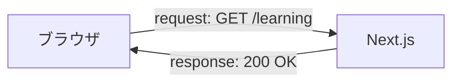

# URL・HTTP・DevTools Network

## 学ぶこと

- URLのscheme、host、port、path
- HTTP methodとstatus code
- requestとresponse
- document、stylesheet、scriptの違い
- DevTools Networkタブの読み方

## 前提知識

ブラウザがサーバーへページを要求し、サーバーが処理結果を返す流れを理解していること。

## 到達目標

- `http://localhost:3000/learning`を部分ごとに説明できる。
- NetworkタブでURL、method、statusを確認できる。
- scriptが複数あっても複数ページを意味しないと説明できる。

## URLを分解する

| 部分 | 例 | 意味 |
|---|---|---|
| scheme | `http` | 通信方式 |
| host | `localhost` | 接続先 |
| port | `3000` | 接続先の待受口 |
| path | `/learning` | 取得したい資源 |

公開環境ではschemeが`https`、hostがVercelのドメインになる。pathは同じアプリ内のページやAPIを表す。

## HTTPの基本

GETは取得、POSTは新しい処理や送信によく使われる。200は成功、404は対象が見つからないことを示す。status codeだけでなくresponse本文やヘッダーも結果の一部である。

## 1ページに複数通信がある理由

ページ本体のdocumentに加えて、CSS、JavaScript、フォント、画像などを別requestで取得する。Next.jsやReactの処理も複数のscriptへ分割されるため、1つの画面を開くだけでもNetworkタブには複数行が並ぶ。

## Networkタブで見る順序

1. 対象ページを再読み込みする。
2. Typeがdocumentの行を選ぶ。
3. Request URLとRequest Methodを見る。
4. Status Codeを見る。
5. stylesheetやscriptが別に取得されていることを確認する。

問題調査では、HTMLが新しいか、CSSが新しいかを別々のrequestとして確認できる。

## 理解確認

1. localhostの`3000`は何を表すか。
2. `GET /learning`のGETと`/learning`はそれぞれ何か。
3. 200と404は何を示すか。
4. documentが1件でもscriptが複数になるのはなぜか。

## Learning Logとの対応

Day 4ではNetworkタブを使い、document、stylesheet、scriptのrequestを確認した。Readingでは通信の観察を、表示不具合やAPI調査にも使える基礎として整理する。
