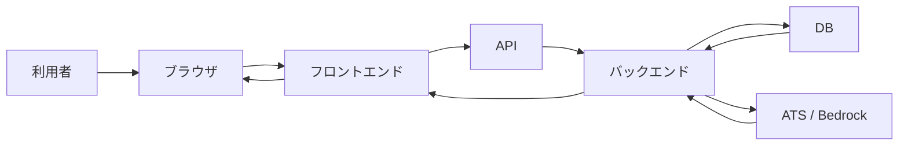

# Webシステムの全体像とデータの流れ

## このLessonで答えられるようになる問い

- ボタンを押してから結果が画面へ出るまで、どこで何が起きるのか。
- フロントエンド、API、バックエンド、DBは何を分担するのか。
- BedrockやATSはTalentScanの内側と外側のどこに位置するのか。

## なぜFDEに必要か

顧客は「候補者を登録したい」「AIで評価したい」のように機能の言葉で話す。FDEは、その要求を画面、API、処理、データ、外部連携へ分け、誰が何を作るか説明する必要がある。全体像がないまま個別技術を学ぶと、コードを見ても、それが全体のどの部分にあたるか判断できない。

## 基本概念

| 要素 | 主な責務 |
|---|---|
| ブラウザ | ページを取得し、表示とユーザー操作を担う |
| フロントエンド | 画面、入力、クリック、表示状態を扱う |
| API | フロントエンドや外部システムが処理を依頼する入口 |
| バックエンド | 入力検証、業務処理、DB操作、外部サービス呼び出しを担う |
| DB | 後から再取得する業務データを保存する |
| 外部サービス | ATS、Bedrock、メールなど別の責任範囲にある機能を提供する |
| インフラ | サーバー、ネットワーク、実行環境、監視などを支える |

要素は製品名ではなく責務で区別する。たとえばVercelは実行・公開環境、BedrockはAI推論を提供する外部サービスである。

## システム内部で実際に起きること

候補者一覧を開く場合、ブラウザはフロントエンドを表示し、フロントエンドがAPIへ候補者データを要求する。バックエンドは要求した利用者を確認し、DBから許可されたデータを取得する。取得結果をJSONへ整え、APIレスポンスとして返す。最後にフロントエンドがJSONを一覧へ変換する。

この流れでは、APIは入口であり処理主体ではない。DBは保存場所であり画面を作らない。JSONは受け渡し形式であり保存や判断を行わない。

## TalentScanでの具体例

TalentScanでは、少なくとも次の二つの流れを区別する。

1. 候補者一覧取得：保存済みデータを取得して表示する。
2. AI評価実行：面接回答から新しい評価を生成し、保存する。

AI評価では、バックエンドが面接回答と評価指示をBedrockへ渡す。Bedrockは推論結果を返すが、TalentScanの権限確認やDB保存は担当しない。バックエンドが結果を検証・整形し、業務データとしてDBへ保存する。

## 処理フローまたは構成図

矢印には、要求、処理結果、保存対象などのデータが流れる。構成図を読むときは箱の名前だけでなく、矢印の方向と中身を確認する。

## よくある誤解

- APIがすべての処理を実行する：APIは処理を呼ぶ境界で、実処理はバックエンドにある。
- JSONがDBである：JSONは主に受け渡し形式で、DBは永続的な保存場所である。
- Bedrockが評価を保存する：Bedrockは推論し、保存はTalentScanのバックエンドとDBが行う。
- フロントエンドには処理がない：入力、表示状態、イベントなどブラウザ側の処理もある。
- サーバーは必ず一台の物理マシンである：クラウドでは複数のサービスや実行単位に分かれることがある。

## FDEとして顧客に確認すべきこと

- 誰がこの機能を使うか。
- どの画面操作を起点にするか。
- 入力データはどこから来るか。
- どの処理をTalentScanが担当し、どこからが外部サービスか。
- 結果をどこへ保存し、誰が後から参照するか。
- 外部サービスが失敗した場合に、利用者へ何を見せるか。

## 理解確認問題

1. APIとバックエンドの違いを説明してください。
2. 候補者一覧で、DB取得と画面表示を担当する要素はそれぞれ何ですか。
3. Bedrockの結果を直接画面へ返さず、バックエンドへ戻す理由は何ですか。
4. JSONは処理、保存、受け渡しのどれを主に担当しますか。

## ミニ演習

「採用担当者が候補者一覧を開く」という要求を、次の形式で分解してください。

| 観点 | 回答 |
|---|---|
| 利用者 |  |
| 画面 |  |
| API |  |
| バックエンド処理 |  |
| 取得するデータ |  |
| 保存場所 |  |
| 失敗しうる場所 |  |

最後に、ブラウザからDBを通って画面へ戻る矢印を自分で描いてください。

## 学習ログへ記録する項目

- 7要素を自分の言葉で説明した結果
- 候補者一覧の処理フロー
- APIとバックエンドについて誤解していた点
- TalentScanの実構成について確認したい点
- ミニ演習で判断できなかった責務
